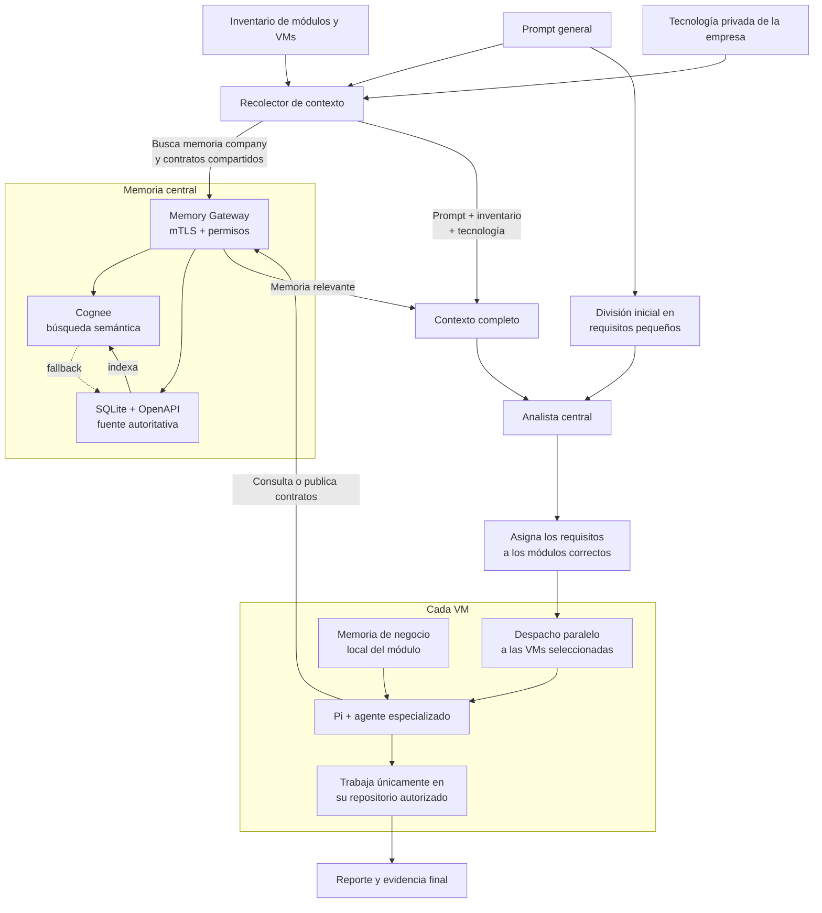

# Orquestador distribuido de agentes con Pi y memoria compartida

Orquestación local por SSH, ejecución con Pi en VMs y memoria central mediante Gateway, SQLite/OpenAPI y Cognee.

Esta infraestructura requiere **una VM para el orquestador** y **una o más VMs de ejecución** para los agentes backend/frontend. La VM del orquestador aloja este repositorio, coordina los despachos por SSH y puede alojar los servicios de memoria; cada VM de ejecución contiene Pi, el agente y su proyecto. Debe existir conectividad SSH hacia las VMs de ejecución y HTTPS hacia el Memory Gateway.

## Flujo completo



## Directorios

- `config/vms.json`: perfiles de VMs.
- `skills/`: agentes y subagentes.
- `pi-harness/`: harness, extensiones y políticas.
- `memory-gateway/`: servidor mTLS y almacenamiento.
- `memoria/`: plantillas de memoria.
- `.private/`: configuración, datos y credenciales locales; fuera de Git.
- `logs/`: solicitudes, reportes y evidencia.
- `tests/`: pruebas automatizadas.

```text
tools/
├── orquestacion/              # Entrada principal, clasificación, análisis de requisitos y memoria
│   ├── orquestar.sh
│   ├── descomponer_requisitos.sh
│   ├── analizar_requisitos.sh
│   ├── clasificar_tarea.sh
│   ├── recolectar_contexto_memoria.sh
│   └── preparar_proyecto.sh
├── despacho/                  # Validación, candados de ejecución física y generación de reportes
│   ├── validar_y_despachar.sh
│   ├── despachar_vm.sh
│   ├── generar_evidencia_agente.sh
│   ├── generar_reporte.sh
│   └── pi_harness.sh
├── vms/                       # Provisionamiento, perfiles, llaves SSH y auditoría de VMs
│   ├── provisionar_vm_pi.sh
│   ├── configurar_perfil_backend_local.sh
│   ├── agregar_repositorio_vm.sh
│   ├── detectar_tecnologias_repositorio.sh
│   ├── limpiar_vm_pi.sh
│   ├── configurar_ssh_vm.sh
│   ├── probar_vms.sh
│   ├── inicializar_memorias_negocio_vm.sh
│   └── actualizar_memoria_negocio_vm.sh
├── sincronizacion/            # Sincronización Git de agentes y monitores de versión
│   ├── sincronizar_agente.sh
│   ├── sincronizar_agente_local.sh
│   ├── instalar_actualizacion_git.sh
│   ├── instalar_monitor_local.sh
│   └── monitor_agentes_locales.sh
├── gateway/                   # Servidor mTLS y exploradores CLI/visual de memoria
│   ├── provisionar_memory_gateway.sh
│   ├── configurar_memory_gateway.sh
│   ├── instalar_identidad_gateway.sh
│   ├── memoria_gateway.sh
│   ├── consultar_memoria.sh
│   ├── visualizar_grafos.py
│   └── visualizador_grafos.html
├── agentes/                   # Generación automatizada de nuevos agentes/skills
│   └── crear_agente.sh
└── remotos/                   # Bootstraps remotos ejecutados en VMs
    ├── actualizar_agente_git.sh
    ├── ciclo_actualizacion_git.sh
    ├── instalar_paquetes_backend.sh
    ├── provisionar_vm_pi.sh
    └── prueba-agentes-bwrap.apparmor
```

## Guía de instalación de memoria en la VM del orquestador

Ejecutar desde la raíz del repositorio en la VM del orquestador. Mantener abiertas las terminales de los servicios.

### 1. Comprobar requisitos

Requisitos: Node.js 24+, Python 3.10+ (con el módulo `venv`), Git, SSH, jq y Ollama. Modelo: `hermes3:latest`.

**a) Paquetes del sistema (jq y Python venv)**

macOS (Homebrew):

```bash
brew install jq
```

Linux (Debian/Ubuntu):

```bash
sudo apt-get update && sudo apt-get install -y jq python3-venv "python3.$(python3 -c 'import sys; print(sys.version_info[1])')-venv"
```

**b) Instalar Ollama**

macOS (Homebrew):

```bash
brew install ollama
```

Linux:

```bash
curl -fsSL https://ollama.com/install.sh | sh
```

**c) Descargar y verificar el modelo**

```bash
ollama pull hermes3:latest
ollama list | grep hermes3
```

**d) Descargar el repositorio**

```bash
git clone git@github.com:CarlosPull/prueba_agentes.git
cd prueba_agentes
```

**e) Cambiar a la rama de trabajo del repositorio**

```bash
git checkout dev
```

Requisitos de hardware para `hermes3:latest` (8B):

| Recurso | Mínimo | Recomendado |
| --- | --- | --- |
| GPU | 6 GB VRAM (o CPU sin GPU) | 8 GB+ VRAM (NVIDIA/Apple Silicon) |
| RAM | 6 GB | 16 GB |

> Es posible utilizar el equipo local sin GPU dedicada siempre y cuando cuente con al menos 16 GB de RAM; la inferencia se ejecutará sobre CPU y será más lenta.

### 2. Preparar el entorno y los certificados — una sola vez

No sobrescribir configuraciones privadas existentes. Para acceso desde VMs, configurar dirección accesible y certificados mediante las herramientas del Gateway.

**a) Crear el directorio privado y el entorno virtual de Python**

Aísla las dependencias de Cognee (`uvicorn`, `fastembed`, etc.) del resto del sistema.

```bash
mkdir -p .private
python3 -m venv .private/cognee-venv
.private/cognee-venv/bin/pip install --upgrade pip
.private/cognee-venv/bin/pip install cognee uvicorn fastembed
```

**b) Generar los certificados PKI del Memory Gateway**

Crea la autoridad certificadora y los certificados mTLS que usarán el Gateway y sus clientes (backend, frontend, analista, admin).

```bash
./memory-gateway/bin/generar_pki.sh .private/memory-gateway-pki 127.0.0.1 backend frontend orchestrator-analyst memory-admin
cp .private/memory-gateway-pki/server.key .private/memory-gateway-pki/server-local.key
cp .private/memory-gateway-pki/server.crt .private/memory-gateway-pki/server-local.crt
```

**c) Preparar la configuración local del Gateway**

Copia las plantillas de ejemplo a `.private/` (fuera de Git) para personalizarlas sin afectar el repositorio.

```bash
mkdir -p .private/memory-gateway-data/openapi
cp memory-gateway/config/clients.example.json .private/memory-gateway-clients.json
cp memoria/tecnologias.example.json .private/tecnologias.json
```

### 3. Iniciar Cognee — terminal 1

Ollama debe estar activo. Conservar las rutas de datos; las variables de Ladybug del ejemplo corresponden a una biblioteca `.dylib`: omitirlas en Linux o si la biblioteca no está instalada.

```bash
cd <ruta_del_repositorio>
PROJECT_ROOT="$PWD"

env \
  SYSTEM_ROOT_DIRECTORY="$PROJECT_ROOT/.private/cognee-system" \
  DATA_ROOT_DIRECTORY="$PROJECT_ROOT/.private/cognee-data" \
  COGNEE_LOGS_DIR="$PROJECT_ROOT/.private/cognee-logs" \
  LBUG_C_API_LIB_PATH="$PROJECT_ROOT/.private/ladybug-v0.19.0/liblbug.dylib" \
  DYLD_LIBRARY_PATH="$PROJECT_ROOT/.private/ladybug-v0.19.0" \
  REQUIRE_AUTHENTICATION=false \
  ENABLE_BACKEND_ACCESS_CONTROL=false \
  VECTOR_DB_PROVIDER=lancedb \
  LLM_PROVIDER=ollama \
  LLM_MODEL=hermes3:latest \
  LLM_ENDPOINT=http://127.0.0.1:11434 \
  LLM_API_KEY=ollama \
  EMBEDDING_PROVIDER=fastembed \
  EMBEDDING_MODEL=sentence-transformers/all-MiniLM-L6-v2 \
  EMBEDDING_DIMENSIONS=384 \
  "$PROJECT_ROOT/.private/cognee-venv/bin/uvicorn" \
  cognee.api.client:app --host 127.0.0.1 --port 8000
```

### 4. Iniciar Memory Gateway — terminal 2

```bash
cd <ruta_del_repositorio>
PROJECT_ROOT="$PWD"

env \
  MEMORY_GATEWAY_HOST=127.0.0.1 \
  MEMORY_GATEWAY_PORT=9443 \
  MEMORY_GATEWAY_DB="$PROJECT_ROOT/.private/memory-gateway-data/gateway.sqlite" \
  MEMORY_GATEWAY_CLIENTS="$PROJECT_ROOT/.private/memory-gateway-clients.json" \
  MEMORY_GATEWAY_OPENAPI_DIR="$PROJECT_ROOT/.private/memory-gateway-data/openapi" \
  MEMORY_GATEWAY_TLS_KEY="$PROJECT_ROOT/.private/memory-gateway-pki/server-local.key" \
  MEMORY_GATEWAY_TLS_CERT="$PROJECT_ROOT/.private/memory-gateway-pki/server-local.crt" \
  MEMORY_GATEWAY_TLS_CA="$PROJECT_ROOT/.private/memory-gateway-pki/ca.crt" \
  COGNEE_BASE_URL=http://127.0.0.1:8000 \
  node memory-gateway/bin/memory-gateway.mjs
```

## Provisionamiento de una VM Pi

### 1. Preparar el acceso SSH

Habilitar SSH en la VM y disponer de acceso al repositorio Git. Desde la VM del orquestador:

```bash
./tools/vms/configurar_ssh_vm.sh <usuario>@<ip>
```

se debe copiar el contenido de la llave publica SSH a GitHub.

### 2. Ejecutar el provisionador desde la VM del orquestador

```bash
./tools/vms/provisionar_vm_pi.sh <perfil> --con-sudo-interactivo
```

Instala automáticamente NVM, Node.js, Pi, el harness y los paquetes del sistema; configura el perfil, proyecto, agente y memoria. No instalar Node ni Pi manualmente.

Al crear un perfil nuevo, solicita estas opciones en orden. Pulsar **Enter** acepta el valor predeterminado mostrado:

| Opción | Qué indicar |
| --- | --- |
| IP y usuario | Dirección de la VM y usuario de Ubuntu para SSH. |
| Origen del proyecto | `local`: elegir un repositorio de la VM del orquestador o indicar su ruta. `git`: indicar URL y rama del proyecto. |
| Stack | `backend` o `frontend`, según el proyecto. |
| Repositorio y módulo | ID del repositorio, nombre del módulo y, para backend, tipo `core` o `module`. |
| Alias | Nombres separados por comas para dirigir tareas al módulo. |
| Agente | Elegir de la lista; se propone `dev-back` para backend y `dev-front` para frontend. |
| Workspace remoto | Carpeta donde quedará el proyecto en la VM. |
| Actualización del agente | `git`: consultar cambios publicados; pide repositorio, rama e intervalo (10/15/20/30/60 segundos). `local`: copiar cambios desde la VM del orquestador mediante el monitor local. Es independiente del origen del proyecto. |
| Versiones | Node (`24.19.0`) y Pi (`latest`); para backend, PHP (`8.4`) y mínimo (`8.4.1`). |
| Memory Gateway | `s` para habilitar memoria compartida mediante mTLS; `N` para omitirla (predeterminado). Con `s`, completar las tres opciones siguientes. |
| ↳ URL del Memory Gateway | `https://<IP_O_DNS_DEL_GATEWAY>:9443`. El script propone `https://192.168.50.61:9443`: reemplazarla si no corresponde al servidor real. No usar `127.0.0.1` para acceder desde otra VM. |
| ↳ Core ID | Identificador del core cuyos contratos se compartirán; propone el ID del repositorio. Ajustarlo al core real y a los permisos del Gateway. |
| ↳ Tenant ID | Identificador de la empresa/tenant; propone `empresa-prueba`. Reemplazarlo por el tenant real autorizado en el Gateway. |

Con `--con-sudo-interactivo`, también se solicita la contraseña `sudo` de la VM cuando sea necesaria.

**Si la IP del Gateway es diferente o cambia:**

1. Indicar la URL correcta durante el asistente o modificar `memory.gateway_url` del perfil en `config/vms.json`; revisar también `memory.core_id` y `memory.tenant_id`.
2. En el servidor del Gateway, cambiar `MEMORY_GATEWAY_HOST=127.0.0.1` por la IP de su interfaz de red (o `0.0.0.0`) y permitir el puerto `9443` sólo desde los equipos autorizados. Mantener Cognee y el visor en localhost.
3. Usar un certificado de servidor cuyo SAN incluya la IP/DNS real, actualizar las rutas `MEMORY_GATEWAY_TLS_CERT` y `MEMORY_GATEWAY_TLS_KEY` si cambian y reiniciar el Gateway. Cambiar la URL no actualiza el certificado.
4. Verificar que la identidad cliente esté autorizada para el Core ID y Tenant ID en `.private/memory-gateway-clients.json`. Instalar o actualizar sus certificados en la VM de ejecución desde el orquestador:

   ```bash
   ./tools/vms/sincronizar_mtls_vm.sh <perfil>
   ```

Conservar la CA existente; si se reemplaza, actualizar también la confianza de todos los clientes afectados.

### 3. Iniciar sesión en Pi dentro de la VM provisionada

```bash
ssh <usuario>@<ip>
pi
```

Si no se reconoce `pi`, `node` o `npm`, cargar NVM en esa misma terminal de la VM y volver a abrir Pi:

```bash
source "$HOME/.nvm/nvm.sh"
pi
```

Iniciar sesión en Pi con la cuenta de Codex, sin `sudo`, antes de ejecutar tareas. Una vez dentro de Pi, seguir:

```text
/login
 → Sign in with an account
   OpenAI Codex unconfigured
   Device code login (headless)
```

### 4. Modificar el archivo de memoria de lógica de negocio

Editar el archivo de memoria de negocio del repositorio dentro de la VM provisionada, en `~/.local/share/prueba-agentes/business/<repositorio>.md`, y describir allí las reglas o lógica de negocio propias del módulo. El agente lee este archivo y lo tiene en cuenta durante el desarrollo, por lo que debe mantenerse actualizado con el conocimiento privado de ese repositorio.

```bash
ssh <usuario>@<ip>
nano ~/.local/share/prueba-agentes/business/<repositorio>.md
```

### 5. Verificar la VM desde la VM del orquestador

Abrir otra terminal en la VM del orquestador, desde la raíz del repositorio:

```bash
./tools/vms/provisionar_vm_pi.sh <perfil> --solo-verificar
```

## Uso

Estos comandos se ejecutan **en la máquina orquestadora**, desde la raíz de este repositorio, no en las VMs de ejecución. Reemplazar los valores entre `<...>`.

### 1. Conectarse a la máquina orquestadora

Desde una terminal de tu equipo (omitir SSH si ya estás en el orquestador):

```bash
ssh <usuario_orquestador>@<ip_orquestador>
```

Dentro de la máquina orquestadora:

```bash
cd <ruta_del_repositorio>/prueba_agentes
./tools/vms/probar_vms.sh
```

Si falta configurar el acceso SSH a una VM de ejecución, ejecutar desde el orquestador y repetir la comprobación:

```bash
./tools/vms/configurar_ssh_vm.sh <usuario_vm>@<ip_vm>
./tools/vms/probar_vms.sh
```

### 2. Ejecutar una tarea desde el orquestador

```bash
./tools/orquestacion/orquestar.sh "objetivo"
```

- Incluir el módulo de destino en la solicitud.
- Usar `solo lectura` o `sin modificar` para impedir escrituras.
- Los destinos independientes se ejecutan en paralelo.

### Alternativa: lanzar una tarea desde un equipo remoto

Cada usuario puede enviar su prompt por SSH sin abrir una sesión interactiva. La ejecución sigue ocurriendo en la máquina orquestadora:

```bash
ssh <usuario_orquestador>@<ip_orquestador> "cd '<ruta_del_repositorio>/prueba_agentes' && ./tools/orquestacion/orquestar.sh 'Prompt de cada usuario'"
```

Reemplazar usuario, IP, ruta absoluta del repositorio en el orquestador y prompt. El usuario remoto debe tener acceso SSH y el entorno del orquestador configurado.
