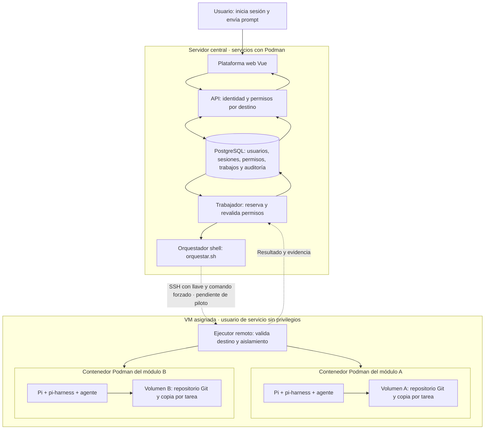
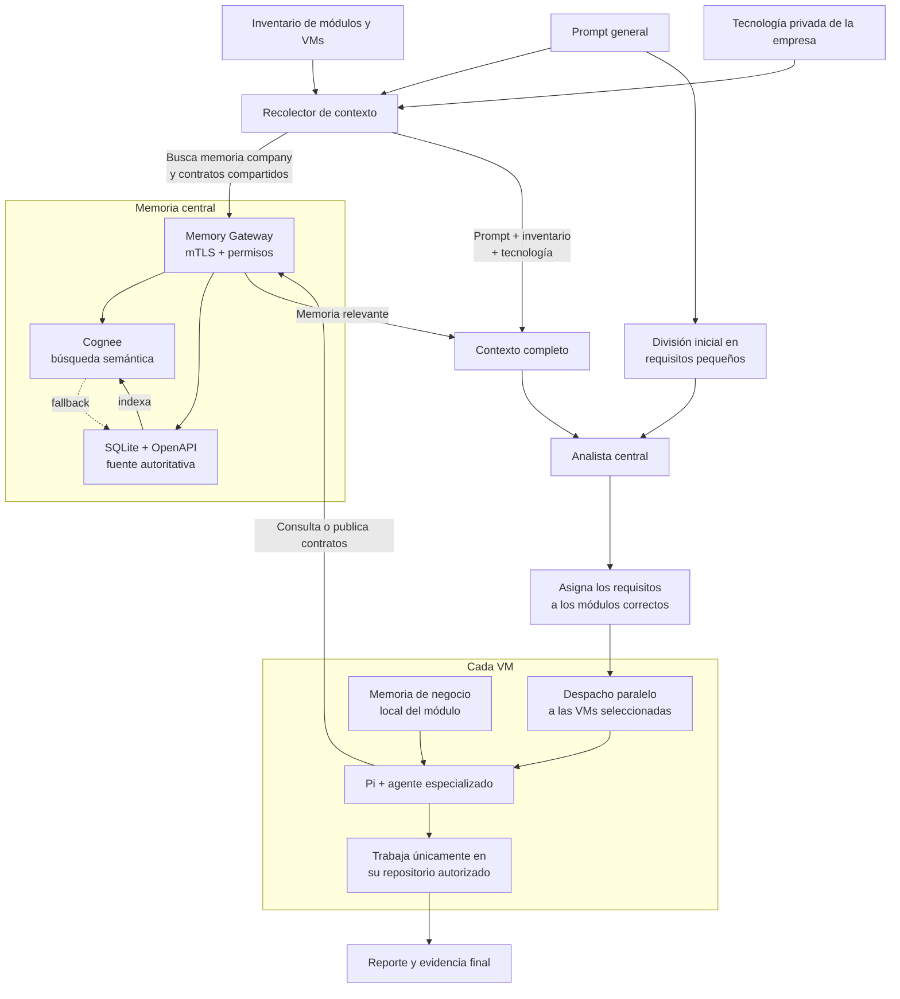

# Plataforma multiusuario de orquestación con Pi y Podman

La nueva arquitectura permite administrar usuarios y asignarles módulos alojados en máquinas virtuales. Cada módulo corresponde a un repositorio Git dentro de un contenedor administrado por **Podman**. El usuario inicia sesión en la plataforma, ve únicamente sus destinos asignados y elige dónde enviar su prompt. El servidor valida sus permisos antes de aceptar y despachar la tarea.

Una VM puede alojar varios módulos y atender a varios usuarios; no es obligatorio tener una VM exclusiva por persona. Tener permiso sobre un módulo no concede acceso a todos los contenedores de esa VM. Podman es el motor de contenedores: el repositorio vive en un volumen del contenedor, no dentro de un «archivo Podman».

> **Estado documentado al 5 de septiembre de 2026:** API, base de datos e interfaz web implementadas y probadas localmente. El trabajador y los ejecutores remotos están escritos, pero **el flujo completo usuario → VM → Podman → Pi todavía no está validado ni habilitado**. El piloto local encontró un fallo de Bubblewrap; la VM nueva `192.168.1.119` sigue pendiente de acceso SSH por llave. No interpretar esta guía como una confirmación de producción.

> **Pausa actual:** la preparación automática desde el panel quedó a medio implementar. El árbol actual falla al compilar (`TS1294` en `plataforma/src/provisioner.ts:94`). Los scripts de arranque también cambiaron y aún no se probaron. **No ejecutar el nuevo despliegue como si estuviera terminado.** Las pruebas exitosas citadas más abajo corresponden a la versión anterior a estos cambios.

## Guías para empezar

- [Pendientes para completar el flujo](#pendientes-para-obtener-la-arquitectura-totalmente-funcional).
- [Configurar una VM y ejecutar el piloto de pruebas](plataforma/GUIA_PRUEBAS_VM.md).
- [Detalle de implementación, evidencia y pendientes](plataforma/README.md).
- [Plan de implementación completo](PLAN_PLATAFORMA_MULTIUSUARIO.md).

## Arquitectura nueva



Las flechas a ambos módulos representan destinos posibles: cada trabajo apunta a **un único destino autorizado**. El usuario web no recibe SSH, credenciales de la VM ni el socket de Podman. La terminal web restringida aún no existe.

## Cómo funciona el flujo

1. El administrador registra una VM y sus destinos. Cada destino identifica VM, repositorio, contenedor y stack (`backend` o `frontend`). Este registro en la web **no crea** la VM ni el contenedor.
2. Asigna usuarios a módulos con permisos de lectura o escritura. Un administrador delegado administra únicamente sus VMs; ser administrador no concede permiso implícito para ejecutar prompts.
3. El usuario inicia sesión. La API consulta sus permisos vigentes y la interfaz muestra sus módulos asignados.
4. Selecciona uno y envía el prompt. La API verifica sesión, asignación, política de lectura y preparación del destino antes de crear un trabajo en PostgreSQL.
5. El trabajador reserva el trabajo, vuelve a comprobar los permisos y genera un inventario limitado a ese destino. Invoca la entrada normal `tools/orquestacion/orquestar.sh` con el adaptador Podman.
6. El adaptador conecta por SSH con una identidad del servidor. Un comando forzado valida el registro remoto y el contenedor antes de ejecutar Pi.
7. Dentro del contenedor, el ejecutor crea una copia Git independiente en `/workspace/ejecuciones/<job>/repo`, a partir de `/workspace/repositorio`, y aplica la política correspondiente mediante pi-harness.
8. El trabajador registra el resultado para consultarlo desde la plataforma. Si pierde confirmación remota, el trabajo queda en `reconciliation_required` y no se reintenta automáticamente.

Los pasos remotos describen el código implementado **pendiente de prueba real**. Cortar SSH o solicitar cancelación no demuestra que el proceso remoto haya terminado. El nuevo ejecutor no hace `git push` ni crea PR: conserva los cambios en la copia de la tarea.

## Qué implementamos y qué falta

| Componente | Estado |
|---|---|
| Inicio/cierre de sesión y cambio de contraseña | Implementado; contraseñas con scrypt y sesiones almacenadas como hash |
| Usuarios, VMs, módulos y permisos | Implementado en API y web, con administración delegada y revocación |
| Prompts, historial, resultados y solicitud de cancelación | Interfaz/API implementadas; resultados Pi reales pendientes |
| PostgreSQL y servidor web con Podman | Arranque local verificado; roles separados de migración y aplicación |
| Cola, idempotencia y revalidación de permisos | Implementadas; pruebas con PostgreSQL real |
| Aislamiento del orquestador por destino | Inventario limitado; memoria global y LLM desactivados en el trabajador |
| SSH restringido y ejecución dentro de Podman | Scripts escritos; falta instalación y validación en VM |
| Imagen de módulo | Base frontend anterior construida; nuevas etapas frontend/backend escritas, sin construir ni validar |
| Bubblewrap dentro de Podman | Prueba local fallida; requiere diagnóstico en la VM de laboratorio |
| Preparación desde el panel y habilitación | API, migración, panel y servicios escritos parcialmente; falta corregir compilación, revisar y probar |
| Terminal web, publicación Git/PR y memoria por usuario | Pendientes |

También corregimos la resolución de varios repositorios dentro de un perfil, el rechazo de destinos inválidos del analista, el candado atómico de despacho y pruebas que dependían de datos locales privados.

Antes de iniciar la preparación automática se verificaron **19 pruebas de plataforma con PostgreSQL en Podman**, cinco pruebas del analista y el candado con 12 invocaciones concurrentes. API y frontend compilaron; se comprobó por HTTP el inicio, recursos, sesión y logout. La suite antigua todavía falla en la visualización de grafos del Memory Gateway. El detalle está en [el registro de continuidad](plataforma/README.md#3-qué-se-verificó-realmente).

## Arrancar la plataforma local

El comando de arranque es el siguiente, pero **debe usarse después de corregir y verificar los cambios pendientes**. La versión actual intenta iniciar también los dos trabajadores. Desde la raíz del repositorio, con Podman, OpenSSL y herramientas SSH instalados:

```bash
bash plataforma/bin/iniciar_podman.sh
```

Abrir **http://127.0.0.1:3100**. El comando construye la imagen, aplica migraciones y arranca API/web y PostgreSQL. Conserva la base en el volumen `orquestador-postgres`. La versión nueva invoca `servicios_trabajadores.sh` para preparación y ejecución, pero esa integración aún no se probó. La versión anterior sí tuvo API/web y PostgreSQL funcionando; no confundir esa imagen con el código actual.

La cuenta inicial de este laboratorio es `carlos@pull.srl`. Sus datos de acceso se guardaron en `.private/plataforma/acceso-inicial.txt`; no versionar ese archivo. Cambiar la contraseña al ingresar. En una instalación nueva sin administrador:

```bash
bash plataforma/bin/crear_admin.sh
```

Todos los contenedores se construyen y ejecutan con **Podman**, sin Docker Engine ni Docker Compose. Las referencias `docker.io/library/...` son ubicaciones de imágenes, no un cambio de motor.

## Pendientes para obtener la arquitectura totalmente funcional

El objetivo de entrega es que un administrador registre una **VM existente**, prepare sus contenedores desde la web y asigne usuarios a módulos. Cada usuario inicia sesión y envía prompts únicamente a los destinos autorizados; el resultado vuelve a su historial. Crear la VM en el hipervisor sigue siendo un paso externo.

**Orden recomendado: A → B → C → D → E → F → G.** Mantener los destinos deshabilitados hasta que sus verificaciones reales pasen. El código existente se conserva para continuar; no empezar de cero ni asumir que todo archivo escrito está terminado.

### A. Recuperar una base compilable y comprobada

- [ ] Corregir `TS1294` en el constructor de `SSHPreparer`, en `plataforma/src/provisioner.ts:94`: sus propiedades declaradas en parámetros no son compatibles con `erasableSyntaxOnly`. Declarar campos y asignarlos explícitamente, conservando la configuración TypeScript.
- [ ] Volver a compilar API y Vue y añadir verificación de tipos de componentes/plantillas Vue.
- [ ] Revisar sintaxis y comportamiento de todos los scripts nuevos; no se ejecutaron en una VM.
- [ ] Probar la migración `003_provisionamiento.sql` tanto sobre una instalación nueva como sobre datos de la versión anterior. Verificar permisos PostgreSQL para las nuevas tablas.
- [ ] Ampliar pruebas de API/cola con conexiones, fuentes Git, preparación, perfiles permitidos, estados y revocaciones. Las 19 pruebas anteriores **no validan** estos cambios.
- [ ] Resolver el fallo antiguo de grafos en `tests/probar_memory_gateway.mjs:137` y ejecutar la suite del visualizador y la suite general completa.

### B. Terminar el alta y preparación de VMs desde la web

- [ ] Validar el formulario de IP/nombre, puerto y huella SSH; probar guardar, consultar, errores y permisos administrativos. Solo el administrador general configura la conexión privilegiada de preparación.
- [ ] Generar y mostrar correctamente la llave pública dedicada de preparación. Completar instrucciones de instalación desde la consola de la VM y alternativas cuando root por SSH esté restringido. No guardar contraseñas de root en la web.
- [ ] Probar verificación de huella antes de autenticar, llave incorrecta, host inaccesible, timeout y cambio de identidad SSH. Revisar normalización de hosts y registros duplicados de una misma VM.
- [ ] Resolver el acceso inicial a `192.168.1.119`: responde por SSH pero rechaza la llave local. El usuario confirmó que aún no conecta; no se configuró remotamente esa VM.
- [ ] Revisar y probar `remoto/preparar.sh` en una VM desechable: paquetes Debian/Ubuntu, cuenta de servicio, UID/GID subordinados, Podman rootless y sesión de usuario. El soporte para otras distribuciones no está implementado.
- [ ] Validar la configuración SSH efectiva del usuario de servicio, propietario de las llaves, comando forzado, ausencia de terminal/reenvíos y acceso administrativo separado.
- [ ] Asegurar que repetir la preparación no sobrescriba instalaciones ajenas ni interrumpa módulos existentes. Revisar bloqueo remoto y transferencia del paquete del instalador antes de modificar archivos compartidos.

### C. Terminar la preparación de cada módulo

- [ ] Probar el formulario de repositorio HTTPS, rama, stack y perfil de credenciales; la selección del agente debe corresponder al stack aprobado. No permitir comandos/rutas arbitrarios desde el formulario.
- [ ] Construir y probar **ambas** etapas de `Containerfile.modulo`: frontend Node/Vue y backend PHP/Composer, incluyendo rutas de Pi, extensiones PHP y requisitos reales del proyecto.
- [ ] Instalar y verificar dependencias del módulo dentro de su entorno aislado. Tener Node/PHP en la imagen no significa que las dependencias del repositorio ya estén instaladas.
- [ ] Probar clonación pública y privada, referencia base, repositorio vacío, rama inexistente y fallo a mitad de clonado. Verificar reintentos sin borrar cambios y coherencia de URL/rama/volumen.
- [ ] Verificar contenedor/volumen exclusivo por destino y manejo de nombres ocupados; no reutilizar recursos de otro módulo.
- [ ] Probar `configurar_credenciales.sh` y los perfiles con `allowedVmIds`. Decidir si se necesita autorización más fina por módulo/administrador antes de compartir un perfil entre módulos de una VM.
- [ ] Comprobar que tokens Git no queden en Git/config/logs y que los secretos Pi no aparezcan en respuestas ni evidencia visible. Completar rotación/revocación; los secretos ya creados no se actualizan automáticamente.
- [ ] Verificar red hacia el proveedor y autenticación real de Pi, más una tarea mínima; el diagnóstico de binarios no prueba esa conexión.
- [ ] Resolver y volver a probar Bubblewrap dentro de Podman. El ensayo local falló al montar `/proc`; no usar modo privilegiado ni retirar el aislamiento como atajo.
- [ ] Probar `verificar_contenedor.sh` con la versión real de Podman: capacidades efectivas, montajes, usuario, namespaces, sockets y políticas. Verificar aislamiento cruzado con dos módulos.

### D. Cerrar habilitación, permisos y recuperación

- [ ] Validar el recorrido `pending → queued → preparing → ready`, errores y estado `review`, con mensajes útiles y evidencia administrativa sin secretos.
- [ ] Asegurar que `execution_ready` solo se active después de verificar remoto, registro del trabajador y autorización vigente; probar fallos entre esas operaciones.
- [ ] Revalidar asignaciones administrativas antes del despacho y al finalizar. Probar carreras de revocación/desactivación y el orden de locks de VM, destino, usuario y trabajo.
- [ ] Probar exclusión de preparación/ejecución simultáneas, reservas entre varios trabajadores, reinicios y pérdida de latidos.
- [ ] Implementar consulta de estado remoto y cancelación confirmada de tareas. Cortar SSH no acredita que Pi terminó.
- [ ] Implementar conciliación administrativa auditada tanto para preparaciones en `review` como para tareas en `reconciliation_required`. No existe aún una operación para resolver esos estados; no reencolar a ciegas.
- [ ] Manejar recursos que quedaron creados antes de fallar y definir reintentos/retirada controlada sin pérdida de repositorios.

### E. Desplegar el servidor central con Podman

- [ ] Construir la imagen nueva con el paquete de provisionamiento y comprobar sus rutas/permisos internos.
- [ ] Probar `servicios_trabajadores.sh`: llaves separadas de preparación/ejecución, volúmenes de secretos, registro compartido y evidencia persistente. La API solo debe recibir la llave pública necesaria.
- [ ] Verificar los tres servicios: API/web, trabajador de preparación y trabajador de ejecución, además de PostgreSQL. Probar sus latidos, fallos y apagado.
- [ ] Revisar actualización coordinada de migraciones/API/trabajadores y recuperación ante fallo de salud. Evitar reemplazar trabajadores durante operaciones activas sin un procedimiento seguro.
- [ ] Probar que reinicios conservan usuarios, permisos, registros y resultados, sin duplicar ejecuciones.
- [ ] Si las pruebas se harán desde otros equipos, configurar HTTPS, origen de la API y acceso de red. La instalación anterior solo publicó `127.0.0.1:3100`.
- [ ] Para servicio permanente, completar systemd/Quadlet o equivalente Podman, respaldo/restauración, retención y limpieza. Revisar cuotas concurrentes y separación de privilegios de base de datos.

### F. Completar una prueba reproducible de extremo a extremo

- [ ] Preparar dos usuarios operadores, un administrador delegado y dos módulos desechables; añadir otra VM para comprobar límites entre VMs.
- [ ] Desde la web: registrar VM → preparar VM → registrar/preparar módulo → asignar usuario → iniciar sesión del usuario → enviar prompt → consultar resultado.
- [ ] Verificar tanto lectura como escritura permitida. La escritura debe quedar en la copia Git de esa tarea y conservar el repositorio base.
- [ ] Manipular el UUID de destino desde un cliente de prueba: el servidor debe rechazar el acceso a módulos/VMs ajenos, aunque se salte la interfaz.
- [ ] Comprobar ausencia de filtraciones por resultados, historial, errores, logs, memoria o herramientas del agente.
- [ ] Probar doble envío, concurrencia por módulo, revocación antes/durante ejecución, desconexión, cancelación y recuperación.
- [ ] Guardar resultados esperados/observados, UUID de trabajo/destino y evidencia; actualizar la guía con comandos realmente comprobados para que otra persona repita el ensayo.

### G. Alcance adicional para recuperar todas las capacidades del orquestador

Estos puntos amplían el piloto básico; no presentarlos como funcionalidades existentes:

- [ ] Reactivar tecnologías, analista LLM y Memory Gateway **solo después de filtrar contexto por permisos de módulo**. El trabajador actual los mantiene desactivados.
- [ ] Soportar un prompt dirigido a varios módulos autorizados, manteniendo trabajos, permisos y resultados separados.
- [ ] Si se requiere publicación: permiso independiente, push y creación real de PR, con revalidación y distinción entre PR y enlace de comparación. El ejecutor nuevo no publica cambios.
- [ ] Si se requiere acceso interactivo: implementar terminal web limitada al contenedor autorizado; no dar una consola general de la VM.
- [ ] Completar recuperación de cuentas y evaluar OIDC/MFA según el uso previsto.
- [ ] Actualizar instrucciones antiguas de `AGENTS.md`/CLI que contradicen el flujo nuevo; QA/security siguen sin despacho automatizado en este piloto.

**Criterio para declarar el flujo listo para pruebas de otra persona:** compilación y pruebas nuevas aprobadas, servicios desplegados, una VM preparada por el procedimiento documentado, Pi ejecutando realmente en dos módulos aislados, permisos positivos/negativos verificados y recuperación de errores comprobada. Hoy no se ha alcanzado ese criterio.

El inventario exacto de archivos a retomar está en [plataforma/README.md](plataforma/README.md). La [guía de VMs](plataforma/GUIA_PRUEBAS_VM.md) conserva los pasos de diagnóstico, pero todavía no es una receta validada de instalación completa.

## Referencia del orquestador CLI anterior

Los apartados siguientes documentan las herramientas shell, memoria y provisionamiento **del flujo SSH anterior**. Se conservan para mantenimiento y diagnóstico; su provisionador no configura automáticamente la nueva plataforma ni sus contenedores. El trabajador nuevo conserva la entrada shell, pero usa su propio inventario limitado y adaptador Podman. La publicación Git y memoria global descritas aquí no están habilitadas en el flujo multiusuario.

## Novedades del Sistema

* 🤖 **Análisis Inteligente con LLM Local (`Hermes 3`)**: `tools/orquestacion/analizar_con_llm.py` analiza semánticamente el prompt y distingue entre solicitudes de UI frontend (Vue) y endpoints backend (Laravel), evitando despachos redundantes o duplicados.
* 🌿 **Flujo de Ramas Dedicadas por Tarea**: Cada despacho crea y conmuta automáticamente a una rama única por tarea (`feature/tarea-<id_despacho>-<timestamp>`) en la VM.
* 🐙 **Publicación Git del flujo CLI anterior**: Al finalizar la tarea, la VM realiza `git push -u origin feature/tarea-...` e incluye un enlace de comparación para proponer un PR; ese enlace no confirma que exista un PR en `REPORTE_PI.md` y `EVIDENCIA_AGENTES.md`.
* 🔑 **Sincronización de Identidad SSH y Git (`configurar_git_vms.sh`)**: Vinculación automática de remotos SSH (`git@github.com:...`) y claves SSH salientes entre la Mac y las VMs.
* 🛡️ **Resiliencia no Bloqueante**: Verificación no bloqueante del Memory Gateway con fallback transparente a inventario local si el Gateway estuviera apagado.

## Flujo del orquestador CLI anterior




El recolector obtiene el inventario, la tecnología privada, la memoria `company` y los contratos compartidos. En paralelo conceptual, el prompt se divide inicialmente por su texto; el analista combina esos requisitos con el contexto recolectado para seleccionar los módulos correctos y aplicar sus restricciones tecnológicas. La memoria de negocio del módulo se incorpora más tarde dentro de la VM elegida.

La entrada principal es:

```bash
./tools/orquestacion/orquestar.sh "En comments agrega un endpoint para consultar comentarios y publica su contrato"
```

Para analizar sin ejecutar agentes:

```bash
./tools/orquestacion/orquestar.sh --clasificar "objetivo"
./tools/orquestacion/orquestar.sh --descomponer "objetivo"
```

Cuando un prompt contiene trabajo para más de un destino, los despachos se lanzan en paralelo en segundo plano y se esperan en conjunto. Un fallo no cancela silenciosamente el resto; el reporte conserva el resultado de cada VM.

Una oración que menciona inequívocamente varios módulos se expande a todos ellos. Las expresiones `solo lectura`, `sin modificar`, `no edites` y equivalentes activan una política fail-closed que elimina la escritura del workspace y la publicación en el Memory Gateway para todos los despachos de la solicitud.

---

## Estructura Modular de `tools/`

Las herramientas del orquestador están organizadas en 7 subcarpetas temáticas especializadas:

```text
tools/
├── orquestacion/              # Entrada principal, clasificación, análisis de requisitos y memoria
│   ├── orquestar.sh
│   ├── descomponer_requisitos.sh
│   ├── analizar_requisitos.sh
│   ├── clasificar_tarea.sh
│   ├── recolectar_contexto_memoria.sh
│   └── preparar_proyecto.sh
├── despacho/                  # Validación, candados de ejecución física y generación de reportes
│   ├── validar_y_despachar.sh
│   ├── despachar_vm.sh
│   ├── generar_evidencia_agente.sh
│   ├── generar_reporte.sh
│   └── pi_harness.sh
├── vms/                       # Provisionamiento, perfiles, llaves SSH y auditoría de VMs
│   ├── provisionar_vm_pi.sh
│   ├── configurar_perfil_backend_local.sh
│   ├── agregar_repositorio_vm.sh
│   ├── detectar_tecnologias_repositorio.sh
│   ├── limpiar_vm_pi.sh
│   ├── configurar_ssh_vm.sh
│   ├── probar_vms.sh
│   ├── inicializar_memorias_negocio_vm.sh
│   └── actualizar_memoria_negocio_vm.sh
├── sincronizacion/            # Sincronización Git de agentes y monitores de versión
│   ├── sincronizar_agente.sh
│   ├── sincronizar_agente_local.sh
│   ├── instalar_actualizacion_git.sh
│   ├── instalar_monitor_local.sh
│   └── monitor_agentes_locales.sh
├── gateway/                   # Servidor mTLS y exploradores CLI/visual de memoria
│   ├── provisionar_memory_gateway.sh
│   ├── configurar_memory_gateway.sh
│   ├── instalar_identidad_gateway.sh
│   ├── memoria_gateway.sh
│   ├── consultar_memoria.sh
│   ├── visualizar_grafos.py
│   └── visualizador_grafos.html
├── agentes/                   # Generación automatizada de nuevos agentes/skills
│   └── crear_agente.sh
└── remotos/                   # Bootstraps remotos ejecutados en VMs
    ├── actualizar_agente_git.sh
    ├── ciclo_actualizacion_git.sh
    ├── instalar_paquetes_backend.sh
    ├── provisionar_vm_pi.sh
    └── prueba-agentes-bwrap.apparmor
```

---

## Componentes y Ubicación

| Componente | Dónde vive | Responsabilidad |
|---|---|---|
| Orquestador `tools/*/*.sh` | Mac | Contexto, análisis, enrutamiento, SSH y consolidación |
| Generador de Agentes | Mac | `tools/agentes/crear_agente.sh` (crea automáticamente la suite en `skills/`) |
| Explorador de Memoria | Mac | `tools/gateway/consultar_memoria.sh` (CLI interactivo de contratos y memoria) |
| Visualizador de grafos | Mac | Python sirve el HTML local y consulta Cognee únicamente a través del Gateway |
| Agentes `skills/*` | Git y copia versionada en cada VM | Instrucciones especializadas por rol (`dev-back`, `dev-front`, `dev-analytics`, `dev-security`, `qa`) |
| Pi y `pi-harness` | Cada VM | Ejecución del agente y aislamiento del workspace |
| Memoria de negocio | Cada VM | Reglas privadas del repositorio seleccionado |
| Memory Gateway | Servidor central | mTLS, RBAC, contratos, auditoría y outbox con fallback SQLite |
| SQLite + OpenAPI | Servidor del Gateway | Fuente autoritativa de contratos compartidos |
| Cognee OSS | Servidor de memoria | Grafo de conocimiento y búsqueda semántica |
| Ollama | Servidor de memoria en esta prueba | LLM local utilizado por Cognee; no ejecuta los agentes |

---

## Guía de Instalación del Entorno Local

Esta sección permite configurar la máquina de un nuevo desarrollador desde cero para dejar operativo todo el entorno local (Ollama, Cognee, Memory Gateway y el Visualizador de Grafos).

### Paso 1: Requisitos Previos

Asegúrate de contar con las siguientes herramientas en tu equipo:
- **Node.js**: `v24.0.0` o superior (`node -v`).
- **Python**: `3.10` o superior (`python3 --version`).
- **Ollama**: Servicio activo con el modelo estructurado instalado:
  ```bash
  ollama pull hermes3:latest
  ```

### Paso 2: Inicializar la carpeta `.private/` (Ejecutar una sola vez)

La carpeta `.private/` está ignorada en `.gitignore` para proteger credenciales y datos locales. En un equipo nuevo, ejecuta este bloque desde la raíz del proyecto (`prueba_agentes`):

```bash
# 1. Crear el entorno virtual e instalar dependencias de Cognee
python3 -m venv .private/cognee-venv
.private/cognee-venv/bin/pip install --upgrade pip
.private/cognee-venv/bin/pip install cognee uvicorn fastembed

# 2. Generar la PKI local mTLS para el Memory Gateway
./memory-gateway/bin/generar_pki.sh .private/memory-gateway-pki 127.0.0.1 backend frontend orchestrator-analyst memory-admin
cp .private/memory-gateway-pki/server.key .private/memory-gateway-pki/server-local.key
cp .private/memory-gateway-pki/server.crt .private/memory-gateway-pki/server-local.crt

# 3. Crear directorios de datos, clientes de gateway e inventario inicial
mkdir -p .private/memory-gateway-data .private/memory-gateway-data/openapi
cp memory-gateway/config/clients.example.json .private/memory-gateway-clients.json
cp memoria/tecnologias.example.json .private/tecnologias.json

# 4. Provisionar la VM e instalar sus certificados mTLS
./tools/vms/provisionar_vm_pi.sh <perfil> --con-sudo-interactivo
./tools/vms/sincronizar_mtls_vm.sh <perfil>
```

---

## Levantar los Servicios Locales en macOS

En este laboratorio, **Ollama, Cognee y el Memory Gateway se ejecutan en la Mac**. Los tres procesos se inician en terminales separadas y permanecen en primer plano (`Ctrl+C` para detenerlos).

Todos los comandos siguientes deben ejecutarse desde la raíz del repositorio.

### 1. Comprobar Ollama

Cognee utiliza un modelo Ollama con soporte de generación estructurada JSON (`hermes3:latest` o `qwen3:8b`). Ollama debe estar activo antes de iniciar Cognee:

```bash
curl --fail --silent http://127.0.0.1:11434/api/tags | jq '.models[].name'
```

Si no responde, abre la aplicación Ollama o inicia su servicio local. La lista debe incluir el modelo configurado (`hermes3:latest` o `qwen3:8b`).

### 2. Levantar Cognee — terminal 1

Este comando utiliza explícitamente `.private/cognee-system` y `.private/cognee-data`, donde vive la memoria existente. No se deben omitir estas rutas porque Cognee utilizaría sus directorios predeterminados y parecería que el grafo está vacío.

> *Nota*: Si no dispones de la biblioteca nativa `ladybug-v0.19.0`, omite las líneas de `GRAPH_DATABASE_PROVIDER`, `LBUG_C_API_LIB_PATH` y `DYLD_LIBRARY_PATH` para que Cognee utilice su proveedor por defecto (Kuzu/NetworkX).

```bash
PROJECT_ROOT="$PWD"

env \
  SYSTEM_ROOT_DIRECTORY="$PROJECT_ROOT/.private/cognee-system" \
  DATA_ROOT_DIRECTORY="$PROJECT_ROOT/.private/cognee-data" \
  COGNEE_LOGS_DIR="$PROJECT_ROOT/.private/cognee-logs" \
  LBUG_C_API_LIB_PATH="$PROJECT_ROOT/.private/ladybug-v0.19.0/liblbug.dylib" \
  DYLD_LIBRARY_PATH="$PROJECT_ROOT/.private/ladybug-v0.19.0" \
  REQUIRE_AUTHENTICATION=false \
  ENABLE_BACKEND_ACCESS_CONTROL=false \
  VECTOR_DB_PROVIDER=lancedb \
  LLM_PROVIDER=ollama \
  LLM_MODEL=hermes3:latest \
  LLM_ENDPOINT=http://127.0.0.1:11434 \
  LLM_API_KEY=ollama \
  EMBEDDING_PROVIDER=fastembed \
  EMBEDDING_MODEL=sentence-transformers/all-MiniLM-L6-v2 \
  EMBEDDING_DIMENSIONS=384 \
  "$PROJECT_ROOT/.private/cognee-venv/bin/uvicorn" \
  cognee.api.client:app --host 127.0.0.1 --port 8000
```

Cognee estará listo cuando muestre `Application startup complete`. Desde otra terminal se puede comprobar sin modificar la memoria:

```bash
curl --fail --silent http://127.0.0.1:8000/api/v1/datasets | jq 'map({id, name})'
```

### 3. Levantar el Memory Gateway — terminal 2

El Gateway es la única puerta de entrada a Cognee para el orquestador y el visor. Conserva SQLite/OpenAPI como fuente autoritativa y protege el acceso mediante mTLS y permisos.

```bash
PROJECT_ROOT="$PWD"

env \
  MEMORY_GATEWAY_HOST=127.0.0.1 \
  MEMORY_GATEWAY_PORT=9443 \
  MEMORY_GATEWAY_DB="$PROJECT_ROOT/.private/memory-gateway-data/gateway.sqlite" \
  MEMORY_GATEWAY_CLIENTS="$PROJECT_ROOT/.private/memory-gateway-clients.json" \
  MEMORY_GATEWAY_OPENAPI_DIR="$PROJECT_ROOT/.private/memory-gateway-data/openapi" \
  MEMORY_GATEWAY_TLS_KEY="$PROJECT_ROOT/.private/memory-gateway-pki/server-local.key" \
  MEMORY_GATEWAY_TLS_CERT="$PROJECT_ROOT/.private/memory-gateway-pki/server-local.crt" \
  MEMORY_GATEWAY_TLS_CA="$PROJECT_ROOT/.private/memory-gateway-pki/ca.crt" \
  COGNEE_BASE_URL=http://127.0.0.1:8000 \
  node memory-gateway/bin/memory-gateway.mjs
```

El Gateway estará listo cuando muestre `Memory Gateway escuchando en https://127.0.0.1:9443`. Para comprobarlo con la identidad administrativa:

```bash
PROJECT_ROOT="$PWD"
export MEMORY_GATEWAY_URL='https://127.0.0.1:9443'
export MEMORY_GATEWAY_CLIENT_CERT="$PROJECT_ROOT/.private/memory-gateway-pki/clients/memory-admin.crt"
export MEMORY_GATEWAY_CLIENT_KEY="$PROJECT_ROOT/.private/memory-gateway-pki/clients/memory-admin.key"
export MEMORY_GATEWAY_CA="$PROJECT_ROOT/.private/memory-gateway-pki/ca.crt"

./tools/gateway/memoria_gateway.sh verificar
```

La respuesta correcta contiene `"status":"ok"` y `"semantic_backend":"cognee-oss"`. Al iniciar, el Gateway también reintenta gradualmente los elementos pendientes de su outbox; por eso Cognee puede comenzar a procesar memoria aunque no se envíe un prompt nuevo.

### 4. Levantar el visualizador — terminal 3

Las variables se deben exportar nuevamente porque cada terminal tiene su propio entorno:

```bash
PROJECT_ROOT="$PWD"
export MEMORY_GATEWAY_URL='https://127.0.0.1:9443'
export MEMORY_GATEWAY_CLIENT_CERT="$PROJECT_ROOT/.private/memory-gateway-pki/clients/memory-admin.crt"
export MEMORY_GATEWAY_CLIENT_KEY="$PROJECT_ROOT/.private/memory-gateway-pki/clients/memory-admin.key"
export MEMORY_GATEWAY_CA="$PROJECT_ROOT/.private/memory-gateway-pki/ca.crt"

.private/cognee-venv/bin/python tools/gateway/visualizar_grafos.py --abrir
```

El visor estará disponible en `http://127.0.0.1:8765`. Se usa el Python del entorno Cognee porque el Python del sistema incluido en macOS puede utilizar LibreSSL sin soporte TLS 1.3.

### Detener y diagnosticar

Para detener cada componente, presiona `Ctrl+C` en su terminal, comenzando por el visor, luego el Gateway y finalmente Cognee. Para saber si ya existe una instancia y evitar `Address already in use`:

```bash
lsof -nP -iTCP:8000 -sTCP:LISTEN   # Cognee
lsof -nP -iTCP:9443 -sTCP:LISTEN   # Memory Gateway
lsof -nP -iTCP:8765 -sTCP:LISTEN   # Visualizador
```

Si `8765` está ocupado y deseas conservar la instancia existente, abre `http://127.0.0.1:8765`. Para iniciar otra instancia deliberadamente, usa `--port 8766`.

### Reconstrucción segura de grafos (`reconstruir-grafos.mjs`)

Si necesitas borrar y regenerar todos los datasets de memoria semántica en Cognee a partir de las fuentes autoritativas (SQLite/OpenAPI para contratos y `.private/tecnologias.json` para tecnologías):

> **IMPORTANTE**: El Memory Gateway debe estar detenido durante este proceso para evitar escrituras concurrentes.

```bash
# 1. Crear respaldo y reconstruir datasets en Cognee
node memory-gateway/bin/reconstruir-grafos.mjs --confirmar-limpieza
```

El proceso realiza lo siguiente de forma segura:
- Genera automáticamente un respaldo completo con timestamp en `.private/graph-backups/YYYY-MM-DDTHH-MM-SS-sssZ/`.
- Elimina únicamente los datasets que inician con el prefijo `prueba_agentes_`.
- Indexa los modelos canónicos:
  - **Contratos compartidos** (`shared_contracts`): `Repositorio → Módulo → Endpoint`.
  - **Tecnologías privadas** (`company`): `Repositorio → Tecnología`.

---

## Creación Automatizada de Nuevos Agentes (`crear_agente.sh`)

Para crear un nuevo agente o skill con su suite completa de subagentes (`analista`, `generador-codigo`, `qa`, `documentador`), ejecuta:

```bash
# Modo interactivo (te preguntará nombre, descripción, misión y herramientas):
./tools/agentes/crear_agente.sh

# Modo directo de un solo comando:
./tools/agentes/crear_agente.sh dev-sec "Especialista en Seguridad" "Auditar código contra OWASP" "pi-harness,snyk"
```

El script genera automáticamente la estructura en `skills/<nombre>/` y realiza el `git add` correspondiente.

---

## Exploración CLI de Memoria y Contratos (`consultar_memoria.sh`)

Puedes explorar los contratos JSON registrados y las reglas corporativas directamente desde la terminal:

```bash
# Ver resumen general de la memoria
./tools/gateway/consultar_memoria.sh

# Listar todos los contratos de endpoints en tabla formateada
./tools/gateway/consultar_memoria.sh --contratos

# Buscar contratos o memorias por palabra clave
./tools/gateway/consultar_memoria.sh --buscar stats

# Inspeccionar el esquema JSON completo de un endpoint
./tools/gateway/consultar_memoria.sh --ver GET /api/posts/{id}/stats

# Listar las reglas de memoria corporativa (capa company)
./tools/gateway/consultar_memoria.sh --empresa
```

### Visualizador web del grafo de Cognee

El visor propio muestra los datasets, nodos y relaciones que Cognee va generando. Se actualiza automáticamente cada 15 segundos, permite buscar por significado y **consolida en un único grafo por repositorio tanto las tecnologías como los módulos y endpoints** naciendo del nodo raíz del `Repositorio`. También permite seleccionar **🌐 Vista General del Proyecto (Todos los Datasets)** para consolidar todo el sistema en un único mapa global.

El navegador **no recibe certificados ni credenciales de Cognee**. Se conecta al servidor Python local; Python usa la identidad administrativa mTLS para consultar dos endpoints protegidos del Memory Gateway, y el Gateway sólo entrega datasets cuyo nombre comienza con `prueba_agentes_`.

La identidad usada debe incluir el permiso `graphs:read` en `clients.json`. Tanto `memory-gateway/config/clients.example.json` como la configuración privada actual contienen ese permiso. Para iniciar únicamente el visor cuando Cognee y el Gateway ya están activos:

```bash
PROJECT_ROOT="$PWD"
export MEMORY_GATEWAY_URL='https://127.0.0.1:9443'
export MEMORY_GATEWAY_CLIENT_CERT="$PROJECT_ROOT/.private/memory-gateway-pki/clients/memory-admin.crt"
export MEMORY_GATEWAY_CLIENT_KEY="$PROJECT_ROOT/.private/memory-gateway-pki/clients/memory-admin.key"
export MEMORY_GATEWAY_CA="$PROJECT_ROOT/.private/memory-gateway-pki/ca.crt"

./tools/gateway/memoria_gateway.sh verificar
.private/cognee-venv/bin/python tools/gateway/visualizar_grafos.py --abrir
```

Ejecuta el bloque desde la raíz de este repositorio. La guía **Levantar la memoria local en macOS** documenta el arranque completo. Se utiliza el Python del entorno Cognee porque incluye OpenSSL con soporte TLS 1.3; el Python del sistema de macOS puede estar enlazado con una versión antigua de LibreSSL. La comprobación `verificar` debe responder antes de abrir el visor.

El visualizador permanece en primer plano. Para detenerlo, vuelve a su terminal y presiona `Ctrl+C`. Si el puerto quedó ocupado por otra instancia, comprueba qué proceso lo usa con `lsof -nP -iTCP:8765 -sTCP:LISTEN`; también puedes iniciar una instancia independiente con `--port 8766`.

Sin `--abrir`, visita `http://127.0.0.1:8765`. El servidor se enlaza sólo a localhost de forma predeterminada y no requiere paquetes Python externos. Cuando se agrega y procesa nueva memoria con `add → cognify`, la siguiente actualización refleja el crecimiento del grafo. Si Cognee está caído, la búsqueda normal conserva el fallback SQLite, pero el grafo no puede representarse porque SQLite no contiene las relaciones semánticas generadas por Cognee.

---

## Las Tres Capas de Memoria

### 1. Tecnología privada de la empresa

La consume el recolector/analista antes de enrutar los requisitos. Puede mantenerse en `.private/tecnologias.json` usando [`memoria/tecnologias.example.json`](memoria/tecnologias.example.json) como plantilla, o publicarse en la capa `company` del Gateway.

La identidad `orchestrator-analyst` sólo puede leer esta capa. Los agentes reciben únicamente el fragmento tecnológico relevante para su requisito.

#### Detección automática al agregar un repositorio

El asistente inicial `provisionar_vm_pi.sh` y el alta adicional `agregar_repositorio_vm.sh` inspeccionan el repositorio local antes de registrarlo. Leen únicamente sus manifiestos; no instalan dependencias ni ejecutan código del proyecto. Reconocen actualmente:

- PHP, Laravel, Illuminate y Composer mediante `composer.json`.
- Node.js, Vue, React, Next.js, Nuxt, Vite, TypeScript y el gestor de paquetes mediante `package.json` y sus archivos de lock.
- Python, Go, Rust, Ruby, Java/Maven, Gradle, .NET y Docker mediante sus manifiestos convencionales.

El resultado se guarda automáticamente en `.private/tecnologias.json` bajo una clave idéntica al `repo-id` registrado en `config/vms.json`:

```json
{
  "version": 1,
  "repositories": {
    "modulo-inventario": {
      "technologies": ["Composer", "Illuminate ^13.0", "PHP ^8.4"],
      "architecture": "módulo backend Illuminate/Composer",
      "constraints": [],
      "detection": {
        "mode": "automatic",
        "sources": ["composer.json"]
      }
    }
  }
}
```

Si ya existe una entrada tecnológica para ese `repo-id`, por defecto se conserva. Para forzar la re-detección de manifiestos y actualizar el registro (por ejemplo, si agregaste nuevos paquetes o dependencias), usa el flag `--refrescar-tecnologias`:

```bash
./tools/vms/agregar_repositorio_vm.sh perfil repo-id modulo module /ruta/local /home/user/remote 'alias1,alias2' --solo-configurar --refrescar-tecnologias
```

#### Sincronización Automática a la Capa `company` del Gateway
Al registrar o refrescar la tecnología de un repositorio, el sistema sincroniza automáticamente un resumen estructurado con la capa `company` del Memory Gateway (`memoria_gateway.sh guardar-tecnologias`). Esto permite que el analista orquestador recupere la información tecnológica centralizada mediante mTLS.

La detección también puede ejecutarse en consola sin registrar el repositorio:

```bash
./tools/vms/detectar_tecnologias_repositorio.sh /ruta/al/repositorio module
```

Los valores detectados son las restricciones declaradas en los manifiestos, no una garantía de las versiones instaladas en la VM.

#### Soporte de Despacho Remoto para Roles `qa` y `dev-security`
El orquestador (`orquestar.sh` y `analizar_requisitos.sh`) admite el despacho remoto automático por SSH para los cuatro stacks de agentes: `backend`, `frontend`, `qa` y `security`. Cuando configuras una VM con `"stack": "qa"` o `"stack": "security"`, las tareas de auditoría de código o generación de suites de pruebas E2E son asignadas y despachadas automáticamente a dicha máquina.

### 2. Contratos compartidos

Contiene endpoints necesarios para que el core, los módulos y el frontend se integren. Backend puede publicar mediante la herramienta de memoria expuesta por `pi-harness`; frontend normalmente sólo consulta.

SQLite y OpenAPI son autoritativos. Cognee ofrece recuperación semántica. El Memory Gateway incluye **fallback automático a SQLite**: si Cognee OSS no responde o está en mantenimiento, el Gateway consulta directamente a SQLite sin interrumpir el flujo.

### 3. Memoria de negocio local

Cada repositorio declara `business_memory` en `config/vms.json`. El archivo vive únicamente en la VM, con permisos `0600`; no vuelve a la Mac, no aparece en los logs y no se guarda en el reporte. `pi-harness` lo incorpora sólo después de elegir el destino.

#### Gestión y Actualización de la Memoria de Negocio:

- **Modo Interactivo (despliega menú de selección de VM/repo y selección de modo)**:
  ```bash
  ./tools/vms/actualizar_memoria_negocio_vm.sh
  ```

- **Sobrescribir por completo el archivo existente en la VM**:
  ```bash
  ./tools/vms/actualizar_memoria_negocio_vm.sh <perfil> <repo_id> "/ruta/archivo.md"
  # O por pipe:
  echo "Regla totalmente nueva" | ./tools/vms/actualizar_memoria_negocio_vm.sh <perfil> <repo_id>
  ```

- **Anexar / Agregar al final (preservando las reglas existentes)**:
  ```bash
  ./tools/vms/actualizar_memoria_negocio_vm.sh --anexar <perfil> <repo_id> "- Regla adicional 2: ..."
  # O por pipe:
  cat nueva_regla.md | ./tools/vms/actualizar_memoria_negocio_vm.sh --anexar <perfil> <repo_id>
  ```

---

## Seguridad

- Cada VM posee certificado y llave mTLS propios. El `CN` identifica el perfil.
- El Gateway aplica permisos, `core_id` y `tenant_id` desde `clients.json`.
- Las VMs nunca reciben credenciales directas de Cognee.
- La visualización requiere una identidad administrativa con `graphs:read`; el Gateway filtra los datasets ajenos al sistema.
- `pi-harness/policies/backend.json` y `frontend.json` definen rutas y comandos permitidos.
- En Linux se usa Bubblewrap; macOS usa Seatbelt y Windows requiere `pi-appcontainer`.
- El flujo es *fail-closed*: si falla la política, sincronización o memoria requerida, Pi no se ejecuta reutilizando estado antiguo.

---

## Provisionamiento de una VM Pi

Guía completa paso a paso para preparar una nueva Máquina Virtual de extremo a extremo:

### Paso 0: Registrar tu clave pública SSH en tu cuenta de GitHub (Solo 1 vez)

Para que las VMs puedan clonar y actualizar repositorios privados de GitHub automáticamente mediante SSH:

> ℹ️ **Verificación automática**: Los scripts `./tools/vms/configurar_ssh_vm.sh` y `./tools/vms/provisionar_vm_pi.sh` comprueban automáticamente si tu clave SSH ya está vinculada con GitHub. Si no lo está, **imprimirán en pantalla tu clave pública y la URL directa** (`https://github.com/settings/keys`), haciendo una pausa hasta que presiones ENTER.

Si deseas agregarla manualmente con anticipación:
1. Muestra la clave pública SSH de tu Mac ejecutando en la terminal:
   ```bash
   cat ~/.ssh/id_ed25519.pub
   ```
2. Copia todo el contenido del texto (comienza con `ssh-ed25519 AAAAC3Nza...`).
3. Ve a tu navegador ingresando a **GitHub.com → Settings → SSH and GPG keys**.
4. Haz clic en **New SSH key**:
   - **Title**: `Mi Mac`
   - **Key type**: `Authentication Key`
   - **Key**: Pega la clave pública copiada.
5. Guarda con **Add SSH key**. *(Esta clave servirá para todas tus VMs presentes y futuras).*


### Paso 1: Preparación del servidor SSH en la VM (Si es una VM recién creada)

Si al intentar conectar obtienes un error del tipo `Connection refused (port 22)` o problemas de dependencias en `apt`:

1. Abre la consola directamente dentro de la VM e instala/repara el servidor SSH:
   ```bash
   # 1. Reparar paquetes e índices de apt si hay caché corrupto o dependencias rotas
   sudo apt clean && sudo rm -rf /var/cache/apt/archives/*.deb
   sudo dpkg --configure -a
   sudo apt --fix-broken install -y
   sudo apt update

   # 2. Instalar el servidor SSH y activar el servicio
   sudo apt install -y openssh-server openssh-sftp-server
   sudo systemctl enable --now ssh
   sudo ufw allow ssh
   ```

### Paso 2: Configurar la conexión SSH sin contraseña hacia la VM

```bash
./tools/vms/configurar_ssh_vm.sh usuario@ip_de_la_vm
# Ejemplo: ./tools/vms/configurar_ssh_vm.sh pruebaconfig@192.168.50.64
```

### Paso 3: Aprovisionar la VM con el asistente interactivo de extremo a extremo

```bash
./tools/vms/provisionar_vm_pi.sh <perfil> --con-sudo-interactivo
# Ejemplo: ./tools/vms/provisionar_vm_pi.sh backend-prueba-config --con-sudo-interactivo
```

El flujo interactivo:
1. Solicita la IP, usuario y el origen del proyecto (`local` o `git`).
2. Detecta la URL remota de GitHub oficial del repositorio del proyecto (`https://github.com/...`) y su rama por defecto.
3. Solicita de forma interactiva la configuración de **Memory Gateway (mTLS)** (URL, Core ID, Tenant ID).
4. Registra el perfil en `config/vms.json` y las tecnologías en `.private/tecnologias.json`.
5. Muestra una lista numerada limpia de los agentes en `skills/` para su selección.
6. Instala los paquetes del sistema, Node, Pi y `pi-harness`.
7. Genera y transfiere automáticamente las credenciales mTLS (`client.crt`, `client.key`, `ca.crt`).
8. Ejecuta la vinculación del repositorio oficial Git dentro de la VM.

### Paso 4: Vinculación o restablecimiento automatizado de Git en las VMs


Puedes configurar o restablecer la identidad Git y la rama de trabajo en todas tus VMs con un solo comando sin entrar manualmente a cada una:

```bash
# Configurar la identidad Git y vincular los repositorios oficiales de GitHub en todas las VMs
./tools/vms/configurar_git_vms.sh --name "Tu Nombre" --email "tu-email@ejemplo.com"

# Desvincular y resetear Git desde cero en todas las VMs
./tools/vms/configurar_git_vms.sh --reset --name "Tu Nombre" --email "tu-email@ejemplo.com"
```

### Comandos de Utilidad y Mantenimiento de VMs:

```bash
# Sincronizar únicamente los certificados mTLS del Memory Gateway
./tools/vms/sincronizar_mtls_vm.sh <perfil>

# Auditar o verificar un perfil en cualquier momento sin reinstalar
./tools/vms/provisionar_vm_pi.sh <perfil> --solo-verificar

# Retirar los artefactos administrados por este orquestador antes de reprovisionar
./tools/vms/limpiar_vm_pi.sh <perfil> --confirmar-limpieza
```


---

## Sincronización Automática de Agentes desde Git

Los agentes pueden actualizarse de dos maneras:

- `agent_update_mode: git`: la VM consulta periódicamente `git_branch` y activa `remote_agent/actual` mediante enlace simbólico atómico.
- `agent_update_mode: local`: el monitor de macOS copia el agente únicamente cuando cambia su hash de contenido.

Flujo de actualización Git:

```text
editar agente en skills/ → git add → git commit → git push a git_branch
                                         ↓
VM consulta origin → descarga git_agent_path → activa nueva versión en ~/agentes/<agente>/actual
```

Para solicitar la comprobación inmediatamente sin esperar al cron:

```bash
./tools/sincronizacion/sincronizar_agente.sh <perfil>
```

---

## Pi Harness y Aislamiento

El harness instalado en cada VM:

1. Detecta el sistema operativo (Linux / macOS / Windows).
2. Selecciona Bubblewrap en Linux, Seatbelt en macOS o `pi-appcontainer` en Windows.
3. Carga `pi-harness/policies/<rol>.json`.
4. Carga únicamente el agente y la extensión de seguridad seleccionados.
5. Incorpora la memoria de negocio local del repositorio.
6. Guarda manifiesto, eventos, errores y auditoría de herramientas.
7. En modo solo lectura genera una política efectiva sin escritura y sin herramientas de publicación de memoria.
8. Conserva el JSONL bruto en la VM y devuelve a la Mac únicamente la respuesta final saneada.

Diagnóstico local del harness:

```bash
./tools/despacho/pi_harness.sh doctor \
  --role backend \
  --workspace /ruta/proyecto \
  --agent-dir ./skills/dev-back

./tools/despacho/pi_harness.sh start \
  --role backend \
  --workspace /ruta/proyecto \
  --agent-dir ./skills/dev-back \
  --task "Agrega una prueba" \
  --dry-run
```

---

## Artefactos de una Ejecución

Cada solicitud crea `logs/<slug>/` con:

- `SOLICITUD.md`: prompt original.
- `CONTEXTO_RECOLECTADO.json`: contexto mínimo utilizado por el analista.
- `REQUISITOS.json` y `REQUISITOS.md`: requisitos y destinos seleccionados.
- `*_output.log`: salida de cada ejecución remota.
- `EVIDENCIA_AGENTES.md`: VM, agente, versión, hash, commit, Pi, workspace y `run_id`.
- `REPORTE_PI.md`: consolidación final.

---

## Diagnóstico y Suites de Pruebas

```bash
# Diagnóstico SSH a las VMs configuradas
./tools/vms/probar_vms.sh

# Verificación de perfiles
./tools/vms/provisionar_vm_pi.sh <perfil> --solo-verificar

# Suites de Pruebas Automatizadas
./tests/probar_automatizacion.sh
node tests/probar_memory_gateway.mjs
bash tests/probar_enrutamiento_modular.sh
bash tests/probar_clasificacion.sh
node tests/probar_extension_pi.mjs
bash tests/probar_despacho_paralelo.sh
bash tests/probar_pi_harness.sh
bash tests/probar_provisionamiento_pi.sh
bash tests/probar_sincronizacion.sh
bash tests/probar_ciclo_actualizacion.sh
bash tests/probar_monitor_local.sh
bash tests/probar_creacion_agente.sh
bash tests/probar_consultar_memoria.sh
python3 tests/probar_visualizador_grafos.py
```

---

## Estado del Laboratorio

- `backend-core`: `192.168.50.193`, repositorio `api-monolitic`.
- `backend-comments`: `192.168.50.40`, repositorio `api-monolitic-comments`.
- `backend-posts`: `192.168.50.231`, repositorio `api-monolitic-posts`.
- Las tres VMs responden por SSH, tienen Pi, `pi-harness`, identidad mTLS y memoria habilitada.
- Cognee y el Gateway se ejecutan en la Mac. Para administración local, Cognee escucha en `127.0.0.1:8000` y el Gateway mTLS en `https://127.0.0.1:9443`.
- Cognee 1.5.3 reutiliza la memoria persistente de `.private/cognee-system`; Ollama aporta `qwen3:8b` y FastEmbed genera los embeddings locales.
- El Gateway local utiliza un certificado `server-local` válido para localhost. La identidad `memory-admin` dispone de `graphs:read`, sin entregar credenciales de Cognee al navegador.
- El visor Python/HTML fue probado con los datasets reales `contracts` y `company`; durante la comprobación mostró 56 nodos y 110 relaciones en el grafo de contratos.
- **100% de las suites de pruebas pasando de forma limpia.**
- Ejecución distribuida paralela verificada en vivo enviando tareas simultáneas a los módulos `posts` y `comments`.
