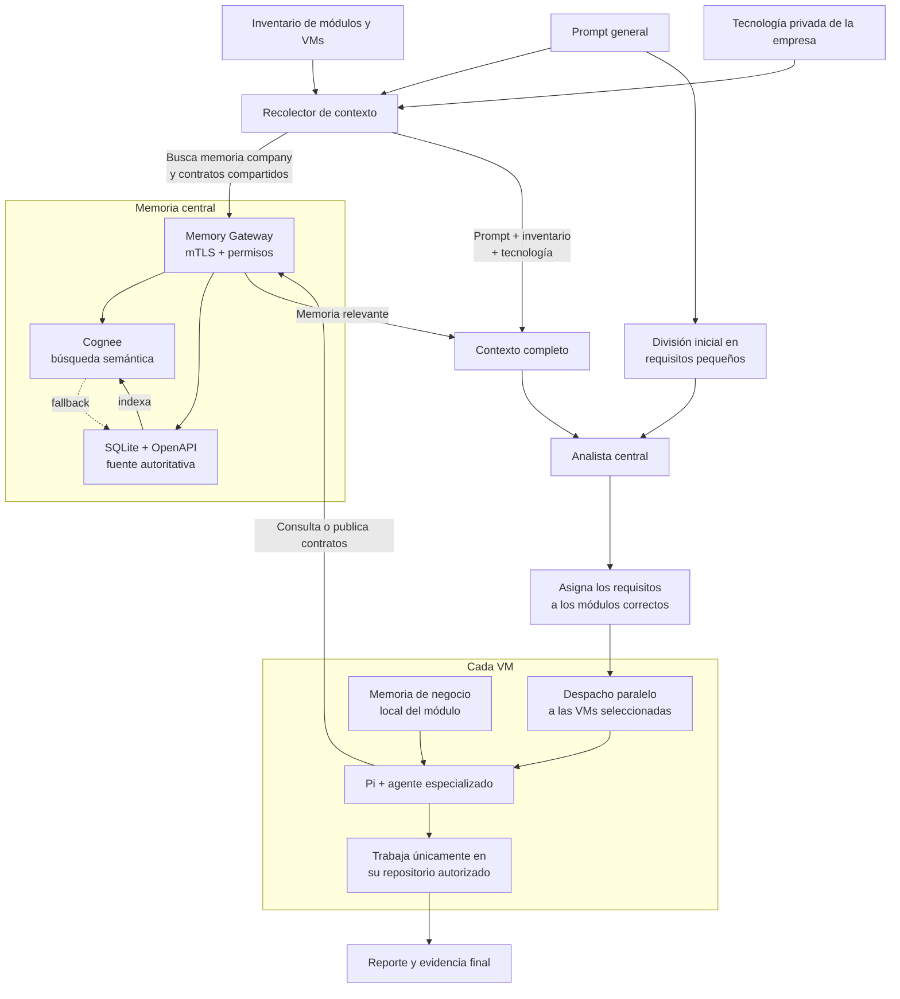

# Orquestador distribuido de agentes con Pi y memoria compartida

Este repositorio contiene un orquestador local escrito en shell script. Recibe un prompt libre, recopila contexto de memoria, lo divide en requisitos atómicos, selecciona la VM y el repositorio correctos y ejecuta cada subtarea mediante **Pi** y `pi-harness` dentro de la VM. La Mac no ejecuta Pi ni modifica directamente los repositorios remotos.

> El flujo anterior basado en Python, OpenCode o `agent-runner` fue retirado. El motor de ejecución actual es exclusivamente Pi.

## Flujo completo



El recolector obtiene el inventario, la tecnología privada, la memoria `company` y los contratos compartidos. En paralelo conceptual, el prompt se divide inicialmente por su texto; el analista combina esos requisitos con el contexto recolectado para seleccionar los módulos correctos y aplicar sus restricciones tecnológicas. La memoria de negocio del módulo se incorpora más tarde dentro de la VM elegida.

La entrada principal es:

```bash
./tools/orquestacion/orquestar.sh "En comments agrega un endpoint para consultar comentarios y publica su contrato"
```

Para analizar sin ejecutar agentes:

```bash
./tools/orquestacion/orquestar.sh --clasificar "objetivo"
./tools/orquestacion/orquestar.sh --descomponer "objetivo"
```

Cuando un prompt contiene trabajo para más de un destino, los despachos se lanzan en paralelo en segundo plano y se esperan en conjunto. Un fallo no cancela silenciosamente el resto; el reporte conserva el resultado de cada VM.

Una oración que menciona inequívocamente varios módulos se expande a todos ellos. Las expresiones `solo lectura`, `sin modificar`, `no edites` y equivalentes activan una política fail-closed que elimina la escritura del workspace y la publicación en el Memory Gateway para todos los despachos de la solicitud.

---

## Estructura Modular de `tools/`

Las herramientas del orquestador están organizadas en 7 subcarpetas temáticas especializadas:

```text
tools/
├── orquestacion/              # Entrada principal, clasificación, análisis de requisitos y memoria
│   ├── orquestar.sh
│   ├── descomponer_requisitos.sh
│   ├── analizar_requisitos.sh
│   ├── clasificar_tarea.sh
│   ├── recolectar_contexto_memoria.sh
│   └── preparar_proyecto.sh
├── despacho/                  # Validación, candados de ejecución física y generación de reportes
│   ├── validar_y_despachar.sh
│   ├── despachar_vm.sh
│   ├── generar_evidencia_agente.sh
│   ├── generar_reporte.sh
│   └── pi_harness.sh
├── vms/                       # Provisionamiento, perfiles, llaves SSH y auditoría de VMs
│   ├── provisionar_vm_pi.sh
│   ├── configurar_perfil_backend_local.sh
│   ├── agregar_repositorio_vm.sh
│   ├── detectar_tecnologias_repositorio.sh
│   ├── limpiar_vm_pi.sh
│   ├── configurar_ssh_vm.sh
│   ├── probar_vms.sh
│   └── inicializar_memorias_negocio_vm.sh
├── sincronizacion/            # Sincronización Git de agentes y monitores de versión
│   ├── sincronizar_agente.sh
│   ├── sincronizar_agente_local.sh
│   ├── instalar_actualizacion_git.sh
│   ├── instalar_monitor_local.sh
│   └── monitor_agentes_locales.sh
├── gateway/                   # Servidor mTLS y explorador CLI de memoria del Memory Gateway
│   ├── provisionar_memory_gateway.sh
│   ├── configurar_memory_gateway.sh
│   ├── instalar_identidad_gateway.sh
│   ├── memoria_gateway.sh
│   └── consultar_memoria.sh
├── agentes/                   # Generación automatizada de nuevos agentes/skills
│   └── crear_agente.sh
└── remotos/                   # Bootstraps remotos ejecutados en VMs
    ├── actualizar_agente_git.sh
    ├── ciclo_actualizacion_git.sh
    ├── instalar_paquetes_backend.sh
    ├── provisionar_vm_pi.sh
    └── prueba-agentes-bwrap.apparmor
```

---

## Componentes y Ubicación

| Componente | Dónde vive | Responsabilidad |
|---|---|---|
| Orquestador `tools/*/*.sh` | Mac | Contexto, análisis, enrutamiento, SSH y consolidación |
| Generador de Agentes | Mac | `tools/agentes/crear_agente.sh` (crea automáticamente la suite en `skills/`) |
| Explorador de Memoria | Mac | `tools/gateway/consultar_memoria.sh` (CLI interactivo de contratos y memoria) |
| Agentes `skills/*` | Git y copia versionada en cada VM | Instrucciones especializadas por rol (`dev-back`, `dev-front`, `dev-analytics`, `dev-security`, `qa`) |
| Pi y `pi-harness` | Cada VM | Ejecución del agente y aislamiento del workspace |
| Memoria de negocio | Cada VM | Reglas privadas del repositorio seleccionado |
| Memory Gateway | Servidor central | mTLS, RBAC, contratos, auditoría y outbox con fallback SQLite |
| SQLite + OpenAPI | Servidor del Gateway | Fuente autoritativa de contratos compartidos |
| Cognee OSS | Servidor de memoria | Grafo de conocimiento y búsqueda semántica |
| Ollama | Servidor de memoria en esta prueba | LLM local utilizado por Cognee; no ejecuta los agentes |

---

## Creación Automatizada de Nuevos Agentes (`crear_agente.sh`)

Para crear un nuevo agente o skill con su suite completa de subagentes (`analista`, `generador-codigo`, `qa`, `documentador`), ejecuta:

```bash
# Modo interactivo (te preguntará nombre, descripción, misión y herramientas):
./tools/agentes/crear_agente.sh

# Modo directo de un solo comando:
./tools/agentes/crear_agente.sh dev-sec "Especialista en Seguridad" "Auditar código contra OWASP" "pi-harness,snyk"
```

El script genera automáticamente la estructura en `skills/<nombre>/` y realiza el `git add` correspondiente.

---

## Exploración CLI de Memoria y Contratos (`consultar_memoria.sh`)

Puedes explorar los contratos JSON registrados y las reglas corporativas directamente desde la terminal:

```bash
# Ver resumen general de la memoria
./tools/gateway/consultar_memoria.sh

# Listar todos los contratos de endpoints en tabla formateada
./tools/gateway/consultar_memoria.sh --contratos

# Buscar contratos o memorias por palabra clave
./tools/gateway/consultar_memoria.sh --buscar stats

# Inspeccionar el esquema JSON completo de un endpoint
./tools/gateway/consultar_memoria.sh --ver GET /api/posts/{id}/stats

# Listar las reglas de memoria corporativa (capa company)
./tools/gateway/consultar_memoria.sh --empresa
```

---

## Las Tres Capas de Memoria

### 1. Tecnología privada de la empresa

La consume el recolector/analista antes de enrutar los requisitos. Puede mantenerse en `.private/tecnologias.json` usando [`memoria/tecnologias.example.json`](memoria/tecnologias.example.json) como plantilla, o publicarse en la capa `company` del Gateway.

La identidad `orchestrator-analyst` sólo puede leer esta capa. Los agentes reciben únicamente el fragmento tecnológico relevante para su requisito.

#### Detección automática al agregar un repositorio

El asistente inicial `provisionar_vm_pi.sh` y el alta adicional `agregar_repositorio_vm.sh` inspeccionan el repositorio local antes de registrarlo. Leen únicamente sus manifiestos; no instalan dependencias ni ejecutan código del proyecto. Reconocen actualmente:

- PHP, Laravel, Illuminate y Composer mediante `composer.json`.
- Node.js, Vue, React, Next.js, Nuxt, Vite, TypeScript y el gestor de paquetes mediante `package.json` y sus archivos de lock.
- Python, Go, Rust, Ruby, Java/Maven, Gradle, .NET y Docker mediante sus manifiestos convencionales.

El resultado se guarda automáticamente en `.private/tecnologias.json` bajo una clave idéntica al `repo-id` registrado en `config/vms.json`:

```json
{
  "version": 1,
  "repositories": {
    "modulo-inventario": {
      "technologies": ["Composer", "Illuminate ^13.0", "PHP ^8.4"],
      "architecture": "módulo backend Illuminate/Composer",
      "constraints": [],
      "detection": {
        "mode": "automatic",
        "sources": ["composer.json"]
      }
    }
  }
}
```

Si ya existe una entrada tecnológica para ese `repo-id`, se conserva para no sobrescribir información revisada manualmente. Si no hay un manifiesto compatible, el alta continúa, crea una entrada sin tecnologías y muestra un aviso para completarla manualmente.

La detección también puede ejecutarse sin registrar el repositorio:

```bash
./tools/vms/detectar_tecnologias_repositorio.sh /ruta/al/repositorio module
```

Los valores detectados son las restricciones declaradas en los manifiestos, no una garantía de las versiones instaladas en la VM.

### 2. Contratos compartidos

Contiene endpoints necesarios para que el core, los módulos y el frontend se integren. Backend puede publicar mediante la herramienta de memoria expuesta por `pi-harness`; frontend normalmente sólo consulta.

SQLite y OpenAPI son autoritativos. Cognee ofrece recuperación semántica. El Memory Gateway incluye **fallback automático a SQLite**: si Cognee OSS no responde o está en mantenimiento, el Gateway consulta directamente a SQLite sin interrumpir el flujo.

### 3. Memoria de negocio local

Cada repositorio declara `business_memory` en `config/vms.json`. El archivo vive únicamente en la VM, con permisos `0600`; no vuelve a la Mac, no aparece en los logs y no se guarda en el reporte. `pi-harness` lo incorpora sólo después de elegir el destino.

---

## Seguridad

- Cada VM posee certificado y llave mTLS propios. El `CN` identifica el perfil.
- El Gateway aplica permisos, `core_id` y `tenant_id` desde `clients.json`.
- Las VMs nunca reciben credenciales directas de Cognee.
- `pi-harness/policies/backend.json` y `frontend.json` definen rutas y comandos permitidos.
- En Linux se usa Bubblewrap; macOS usa Seatbelt y Windows requiere `pi-appcontainer`.
- El flujo es *fail-closed*: si falla la política, sincronización o memoria requerida, Pi no se ejecuta reutilizando estado antiguo.

---

## Provisionamiento de una VM Pi

Para aprovisionar una máquina virtual nueva de extremo a extremo:

```bash
# Paso 1: Copiar tu llave SSH a la VM
./tools/vms/configurar_ssh_vm.sh usuario@ip_de_la_vm

# Paso 2: Provisionar la VM con el asistente interactivo (incluye menú de selección de agentes en skills/)
./tools/vms/provisionar_vm_pi.sh <perfil> --con-sudo-interactivo

# Auditar o verificar un perfil en cualquier momento sin reinstalar
./tools/vms/provisionar_vm_pi.sh <perfil> --solo-verificar
```

Cuando el perfil todavía no existe, el flujo interactivo:

1. Solicita la IP, el usuario y el origen del proyecto.
2. Busca repositorios en el directorio padre de este proyecto —normalmente `/Users/carlos/Documents/GitHub`— y muestra una lista numerada. Se puede definir otra raíz con `PRUEBA_AGENTES_REPOSITORIES_ROOT` o elegir una ruta manual.
3. Detecta las tecnologías del repositorio seleccionado, propone `backend` o `frontend` y usa el nombre de la carpeta como `repo-id` predeterminado.
4. Registra el perfil en `config/vms.json` y la tecnología en `.private/tecnologias.json`.
5. Continúa con el agente de `skills/`, workspace, actualización, rama, intervalo y versiones.

La selección y detección local también se ejecutan con `--solo-configurar`, por lo que es posible preparar y revisar el perfil sin conectarse todavía a la VM. Para proyectos configurados exclusivamente mediante una URL Git no existe una copia local que inspeccionar durante esta fase; su tecnología debe registrarse cuando haya una copia local disponible.

Para retirar los artefactos administrados por este orquestador antes de reprovisionar:

```bash
./tools/vms/limpiar_vm_pi.sh <perfil> --confirmar-limpieza
```

---

## Sincronización Automática de Agentes desde Git

Los agentes pueden actualizarse de dos maneras:

- `agent_update_mode: git`: la VM consulta periódicamente `git_branch` y activa `remote_agent/actual` mediante enlace simbólico atómico.
- `agent_update_mode: local`: el monitor de macOS copia el agente únicamente cuando cambia su hash de contenido.

Flujo de actualización Git:

```text
editar agente en skills/ → git add → git commit → git push a git_branch
                                         ↓
VM consulta origin → descarga git_agent_path → activa nueva versión en ~/agentes/<agente>/actual
```

Para solicitar la comprobación inmediatamente sin esperar al cron:

```bash
./tools/sincronizacion/sincronizar_agente.sh <perfil>
```

---

## Pi Harness y Aislamiento

El harness instalado en cada VM:

1. Detecta el sistema operativo (Linux / macOS / Windows).
2. Selecciona Bubblewrap en Linux, Seatbelt en macOS o `pi-appcontainer` en Windows.
3. Carga `pi-harness/policies/<rol>.json`.
4. Carga únicamente el agente y la extensión de seguridad seleccionados.
5. Incorpora la memoria de negocio local del repositorio.
6. Guarda manifiesto, eventos, errores y auditoría de herramientas.
7. En modo solo lectura genera una política efectiva sin escritura y sin herramientas de publicación de memoria.
8. Conserva el JSONL bruto en la VM y devuelve a la Mac únicamente la respuesta final saneada.

Diagnóstico local del harness:

```bash
./tools/despacho/pi_harness.sh doctor \
  --role backend \
  --workspace /ruta/proyecto \
  --agent-dir ./skills/dev-back

./tools/despacho/pi_harness.sh start \
  --role backend \
  --workspace /ruta/proyecto \
  --agent-dir ./skills/dev-back \
  --task "Agrega una prueba" \
  --dry-run
```

---

## Artefactos de una Ejecución

Cada solicitud crea `logs/<slug>/` con:

- `SOLICITUD.md`: prompt original.
- `CONTEXTO_RECOLECTADO.json`: contexto mínimo utilizado por el analista.
- `REQUISITOS.json` y `REQUISITOS.md`: requisitos y destinos seleccionados.
- `*_output.log`: salida de cada ejecución remota.
- `EVIDENCIA_AGENTES.md`: VM, agente, versión, hash, commit, Pi, workspace y `run_id`.
- `REPORTE_PI.md`: consolidación final.

---

## Diagnóstico y Suites de Pruebas

```bash
# Diagnóstico SSH a las VMs configuradas
./tools/vms/probar_vms.sh

# Verificación de perfiles
./tools/vms/provisionar_vm_pi.sh <perfil> --solo-verificar

# Suites de Pruebas Automatizadas
./tests/probar_automatizacion.sh
node tests/probar_memory_gateway.mjs
bash tests/probar_enrutamiento_modular.sh
bash tests/probar_clasificacion.sh
node tests/probar_extension_pi.mjs
bash tests/probar_despacho_paralelo.sh
bash tests/probar_pi_harness.sh
bash tests/probar_provisionamiento_pi.sh
bash tests/probar_sincronizacion.sh
bash tests/probar_ciclo_actualizacion.sh
bash tests/probar_monitor_local.sh
bash tests/probar_creacion_agente.sh
bash tests/probar_consultar_memoria.sh
```

---

## Estado del Laboratorio

- `backend-core`: `192.168.50.193`, repositorio `api-monolitic`.
- `backend-comments`: `192.168.50.40`, repositorio `api-monolitic-comments`.
- `backend-posts`: `192.168.50.231`, repositorio `api-monolitic-posts`.
- Las tres VMs responden por SSH, tienen Pi, `pi-harness`, identidad mTLS y memoria habilitada.
- El Gateway escucha en `https://192.168.50.31:9443` con fallback SQLite activo.
- **100% de las suites de pruebas pasando de forma limpia.**
- Ejecución distribuida paralela verificada en vivo enviando tareas simultáneas a los módulos `posts` y `comments`.
