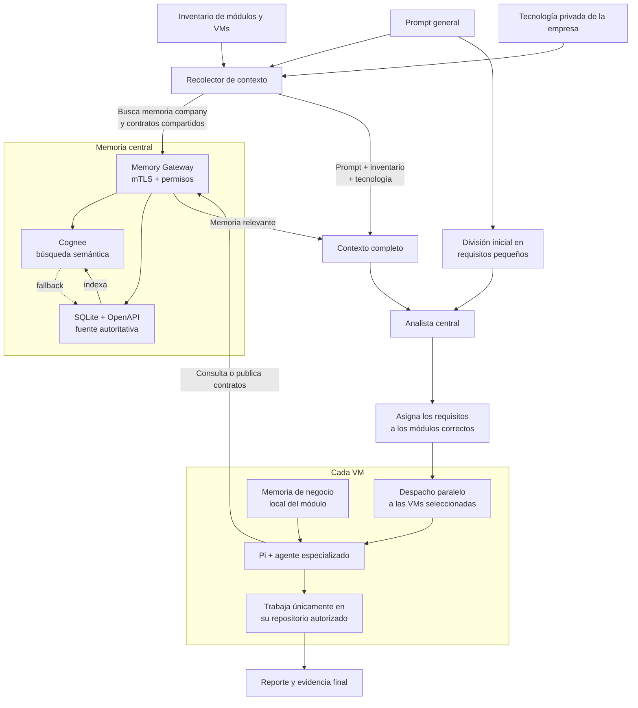

# Orquestador distribuido de agentes con Pi y memoria compartida

Orquestación local por SSH, ejecución con Pi en VMs y memoria central mediante Gateway, SQLite/OpenAPI y Cognee.

## Flujo completo



## Directorios

- `config/vms.json`: perfiles de VMs.
- `skills/`: agentes y subagentes.
- `pi-harness/`: harness, extensiones y políticas.
- `memory-gateway/`: servidor mTLS y almacenamiento.
- `memoria/`: plantillas de memoria.
- `.private/`: configuración, datos y credenciales locales; fuera de Git.
- `logs/`: solicitudes, reportes y evidencia.
- `tests/`: pruebas automatizadas.

```text
tools/
├── orquestacion/              # Entrada principal, clasificación, análisis de requisitos y memoria
│   ├── orquestar.sh
│   ├── descomponer_requisitos.sh
│   ├── analizar_requisitos.sh
│   ├── clasificar_tarea.sh
│   ├── recolectar_contexto_memoria.sh
│   └── preparar_proyecto.sh
├── despacho/                  # Validación, candados de ejecución física y generación de reportes
│   ├── validar_y_despachar.sh
│   ├── despachar_vm.sh
│   ├── generar_evidencia_agente.sh
│   ├── generar_reporte.sh
│   └── pi_harness.sh
├── vms/                       # Provisionamiento, perfiles, llaves SSH y auditoría de VMs
│   ├── provisionar_vm_pi.sh
│   ├── configurar_perfil_backend_local.sh
│   ├── agregar_repositorio_vm.sh
│   ├── detectar_tecnologias_repositorio.sh
│   ├── limpiar_vm_pi.sh
│   ├── configurar_ssh_vm.sh
│   ├── probar_vms.sh
│   ├── inicializar_memorias_negocio_vm.sh
│   └── actualizar_memoria_negocio_vm.sh
├── sincronizacion/            # Sincronización Git de agentes y monitores de versión
│   ├── sincronizar_agente.sh
│   ├── sincronizar_agente_local.sh
│   ├── instalar_actualizacion_git.sh
│   ├── instalar_monitor_local.sh
│   └── monitor_agentes_locales.sh
├── gateway/                   # Servidor mTLS y exploradores CLI/visual de memoria
│   ├── provisionar_memory_gateway.sh
│   ├── configurar_memory_gateway.sh
│   ├── instalar_identidad_gateway.sh
│   ├── memoria_gateway.sh
│   ├── consultar_memoria.sh
│   ├── visualizar_grafos.py
│   └── visualizador_grafos.html
├── agentes/                   # Generación automatizada de nuevos agentes/skills
│   └── crear_agente.sh
└── remotos/                   # Bootstraps remotos ejecutados en VMs
    ├── actualizar_agente_git.sh
    ├── ciclo_actualizacion_git.sh
    ├── instalar_paquetes_backend.sh
    ├── provisionar_vm_pi.sh
    └── prueba-agentes-bwrap.apparmor
```

## Uso

Ejecutar desde la raíz del repositorio. Reemplazar los valores entre `<...>`.

```bash
./tools/orquestacion/orquestar.sh "objetivo"
./tools/orquestacion/orquestar.sh --clasificar "objetivo"
./tools/orquestacion/orquestar.sh --descomponer "objetivo"
```

- Incluir el módulo de destino en la solicitud.
- Usar `solo lectura` o `sin modificar` para impedir escrituras.
- Los destinos independientes se ejecutan en paralelo.

## Provisionamiento de una VM Pi

`config/vms.json` está vacío: registrar los nuevos perfiles antes de ejecutar tareas.

1. Habilitar SSH en la VM y disponer de acceso al repositorio Git.
2. Configurar SSH, provisionar y verificar:

```bash
./tools/vms/configurar_ssh_vm.sh <usuario>@<ip>
./tools/vms/provisionar_vm_pi.sh <perfil> --con-sudo-interactivo
./tools/vms/provisionar_vm_pi.sh <perfil> --solo-verificar
```

El asistente registra el perfil, proyecto, agente y memoria; instala Pi y el harness.

### Mantenimiento

```bash
./tools/vms/probar_vms.sh
./tools/vms/sincronizar_mtls_vm.sh <perfil>
./tools/vms/configurar_git_vms.sh --name "Tu Nombre" --email "tu-email@ejemplo.com"
./tools/vms/actualizar_memoria_negocio_vm.sh
./tools/vms/actualizar_memoria_negocio_vm.sh --anexar <perfil> <repo_id> "Regla adicional"
```

**Limpieza remota: retira artefactos administrados. Ejecutar sólo sobre el perfil previsto.**

```bash
./tools/vms/limpiar_vm_pi.sh <perfil> --confirmar-limpieza
```

## Sincronización de agentes

- `agent_update_mode: git`: publicar con `git commit` y `git push` a `git_branch`.
- `agent_update_mode: local`: copiar cambios mediante el monitor local.

```bash
./tools/sincronizacion/sincronizar_agente.sh <perfil>
./tools/sincronizacion/sincronizar_agente_local.sh <perfil>
./tools/sincronizacion/instalar_monitor_local.sh
```

## Memoria local en macOS

Requisitos: Node.js 24+, Python 3.10+, Git, SSH, jq y Ollama. Modelo: `hermes3:latest`.

### Preparación inicial — una sola vez

```bash
ollama pull hermes3:latest
python3 -m venv .private/cognee-venv
.private/cognee-venv/bin/pip install --upgrade pip
.private/cognee-venv/bin/pip install cognee uvicorn fastembed

./memory-gateway/bin/generar_pki.sh .private/memory-gateway-pki 127.0.0.1 backend frontend orchestrator-analyst memory-admin
cp .private/memory-gateway-pki/server.key .private/memory-gateway-pki/server-local.key
cp .private/memory-gateway-pki/server.crt .private/memory-gateway-pki/server-local.crt
mkdir -p .private/memory-gateway-data/openapi
cp memory-gateway/config/clients.example.json .private/memory-gateway-clients.json
cp memoria/tecnologias.example.json .private/tecnologias.json
```

No sobrescribir configuraciones privadas existentes. Para acceso desde VMs, configurar dirección accesible y certificados mediante las herramientas del Gateway.

### Cognee — terminal 1

Ollama debe estar activo. Conservar las rutas de datos; omitir las variables de Ladybug si la biblioteca no está instalada.

```bash
PROJECT_ROOT="$PWD"

env \
  SYSTEM_ROOT_DIRECTORY="$PROJECT_ROOT/.private/cognee-system" \
  DATA_ROOT_DIRECTORY="$PROJECT_ROOT/.private/cognee-data" \
  COGNEE_LOGS_DIR="$PROJECT_ROOT/.private/cognee-logs" \
  LBUG_C_API_LIB_PATH="$PROJECT_ROOT/.private/ladybug-v0.19.0/liblbug.dylib" \
  DYLD_LIBRARY_PATH="$PROJECT_ROOT/.private/ladybug-v0.19.0" \
  REQUIRE_AUTHENTICATION=false \
  ENABLE_BACKEND_ACCESS_CONTROL=false \
  VECTOR_DB_PROVIDER=lancedb \
  LLM_PROVIDER=ollama \
  LLM_MODEL=hermes3:latest \
  LLM_ENDPOINT=http://127.0.0.1:11434 \
  LLM_API_KEY=ollama \
  EMBEDDING_PROVIDER=fastembed \
  EMBEDDING_MODEL=sentence-transformers/all-MiniLM-L6-v2 \
  EMBEDDING_DIMENSIONS=384 \
  "$PROJECT_ROOT/.private/cognee-venv/bin/uvicorn" \
  cognee.api.client:app --host 127.0.0.1 --port 8000
```

### Memory Gateway — terminal 2

```bash
PROJECT_ROOT="$PWD"

env \
  MEMORY_GATEWAY_HOST=127.0.0.1 \
  MEMORY_GATEWAY_PORT=9443 \
  MEMORY_GATEWAY_DB="$PROJECT_ROOT/.private/memory-gateway-data/gateway.sqlite" \
  MEMORY_GATEWAY_CLIENTS="$PROJECT_ROOT/.private/memory-gateway-clients.json" \
  MEMORY_GATEWAY_OPENAPI_DIR="$PROJECT_ROOT/.private/memory-gateway-data/openapi" \
  MEMORY_GATEWAY_TLS_KEY="$PROJECT_ROOT/.private/memory-gateway-pki/server-local.key" \
  MEMORY_GATEWAY_TLS_CERT="$PROJECT_ROOT/.private/memory-gateway-pki/server-local.crt" \
  MEMORY_GATEWAY_TLS_CA="$PROJECT_ROOT/.private/memory-gateway-pki/ca.crt" \
  COGNEE_BASE_URL=http://127.0.0.1:8000 \
  node memory-gateway/bin/memory-gateway.mjs
```

### Visualizador — terminal 3

```bash
PROJECT_ROOT="$PWD"
export MEMORY_GATEWAY_URL='https://127.0.0.1:9443'
export MEMORY_GATEWAY_CLIENT_CERT="$PROJECT_ROOT/.private/memory-gateway-pki/clients/memory-admin.crt"
export MEMORY_GATEWAY_CLIENT_KEY="$PROJECT_ROOT/.private/memory-gateway-pki/clients/memory-admin.key"
export MEMORY_GATEWAY_CA="$PROJECT_ROOT/.private/memory-gateway-pki/ca.crt"

.private/cognee-venv/bin/python tools/gateway/visualizar_grafos.py --abrir
```

- Visor: `http://127.0.0.1:8765`. Identidad requerida: `graphs:read`.
- Detener con `Ctrl+C`: visor → Gateway → Cognee.

### Consultas y diagnóstico

```bash
./tools/gateway/memoria_gateway.sh verificar
./tools/gateway/consultar_memoria.sh --contratos
./tools/gateway/consultar_memoria.sh --buscar stats
./tools/gateway/consultar_memoria.sh --empresa
curl --fail --silent http://127.0.0.1:8000/api/v1/datasets | jq 'map({id, name})'
lsof -nP -iTCP:8000 -iTCP:9443 -iTCP:8765 -sTCP:LISTEN
```

### Reconstruir grafos

**Detener el Gateway y mantener Cognee activo.** Se respaldan los datos y se regeneran los datasets administrados.

```bash
./tools/gateway/reconstruir_grafos.sh
```

## Reglas esenciales

- Tecnología privada: `.private/tecnologias.json` y capa `company`.
- Contratos compartidos: SQLite/OpenAPI autoritativos; Cognee para búsqueda semántica.
- Memoria de negocio: archivo privado en la VM, definido por `business_memory`.
- Acceso a memoria mediante Gateway con mTLS; sin acceso directo de las VMs a Cognee.
- Aislamiento: Bubblewrap en Linux, Seatbelt en macOS y `pi-appcontainer` en Windows.
- JSONL bruto y prompts enriquecidos permanecen en la VM; la Mac recibe salida saneada.

## Resultados

En `logs/<slug>/`:
- `SOLICITUD.md`: solicitud original.
- `CONTEXTO_RECOLECTADO.json`: contexto resumido.
- `REQUISITOS.json` y `REQUISITOS.md`: requisitos y destinos.
- `*_output.log`: salida por despacho.
- `EVIDENCIA_AGENTES.md`: VM, agente, versión y `run_id`.
- `REPORTE_PI.md`: resultado consolidado.

## Pruebas

```bash
./tests/probar_automatizacion.sh
node tests/probar_memory_gateway.mjs
bash tests/probar_enrutamiento_modular.sh
bash tests/probar_clasificacion.sh
node tests/probar_extension_pi.mjs
bash tests/probar_despacho_paralelo.sh
bash tests/probar_pi_harness.sh
bash tests/probar_provisionamiento_pi.sh
bash tests/probar_sincronizacion.sh
bash tests/probar_ciclo_actualizacion.sh
bash tests/probar_monitor_local.sh
bash tests/probar_creacion_agente.sh
bash tests/probar_consultar_memoria.sh
python3 tests/probar_visualizador_grafos.py
```
